GDP\_Prediction EDA
================
Stuart Miller
2020-03-03 10:02:40

  - [Data](#data)
      - [Variables](#variables)
  - [EDA](#eda)
      - [Univariate](#univariate)
          - [gdp\_change](#gdp_change)
          - [unrate](#unrate)
          - [nfjobs](#nfjobs)
          - [treas10yr](#treas10yr)
          - [treas3mo](#treas3mo)
          - [treas10yr3mo](#treas10yr3mo)
          - [fedintrate](#fedintrate)
          - [libor3mo](#libor3mo)
          - [personincomechg](#personincomechg)
          - [corpprofitchg](#corpprofitchg)
      - [Multivariate](#multivariate)
          - [GDP Change vs Unemployment
            Rate](#gdp-change-vs-unemployment-rate)
          - [GDP Change vs Non-farm Jobs](#gdp-change-vs-non-farm-jobs)
          - [GDP Change vs 10 Year Treasury
            Yield](#gdp-change-vs-10-year-treasury-yield)
          - [GDP Change vs 3 Month Treasury
            Yield](#gdp-change-vs-3-month-treasury-yield)
          - [GDP Change vs Treasury Yield 10 Year 3 Month
            Difference](#gdp-change-vs-treasury-yield-10-year-3-month-difference)
          - [GDP Change vs Federal Interest
            Rate](#gdp-change-vs-federal-interest-rate)
          - [GDP Change vs 3 Month LIBOR](#gdp-change-vs-3-month-libor)
          - [GDP Change vs Change in Personal
            Income](#gdp-change-vs-change-in-personal-income)
          - [GDP Change vs Change in Corparate
            Profits](#gdp-change-vs-change-in-corparate-profits)
          - [Explanatory Variables](#explanatory-variables)

# Data

There are 135 observations of 11 variables.

## Variables

| Variable        | Description                                   |
| --------------- | --------------------------------------------- |
| Date            | Date of observation                           |
| gdp\_change     | Change in GDP from the previous observation   |
| unrate          | Unemployment rate                             |
| nfjobs          | Non-farming jobs                              |
| treas10yr       | 10 Year US Treasury Yield                     |
| treas3mo        | 3 Month US Treasury Yield                     |
| treas10yr3mo    | Difference between `treas10yr` and `treas3mo` |
| fedintrate      | US federal interest rate                      |
| libor3mo        | 3 Month LIBOR rate                            |
| personincomechg | Personal income change                        |
| corpprofitchg   | Corporate profit change                       |

Change in GDP (`gdp_change`) is the response variable. The observations
are taken quarterly, starting at 1986 Q1 and ending 2019 Q3.

# EDA

## Univariate

### gdp\_change

Based on the plot of the realization, the assuming the series has a
constant, non-zero mean appears to be reasonable. The sample
autocorrelations are positive and fall off quickly. The parzen window
shows a dominate frequency at 0 with some evidence of frequencies at
approximately 0.2, 0.3 and 0.45, which is confirmed by the periodogram.
The ACF for the first and second half of the series do not appear to be
the same, which is evidence against this data coming from a stationary
process.

``` r
vals <- plotts.sample.wge(data$gdp_change)
```

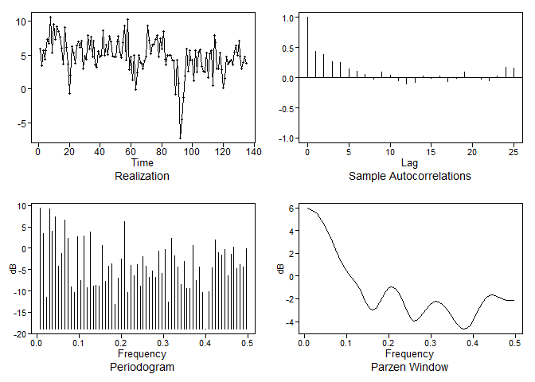<!-- -->

``` r
acf(data$gdp_change[1:68])
acf(data$gdp_change[69:135])
```

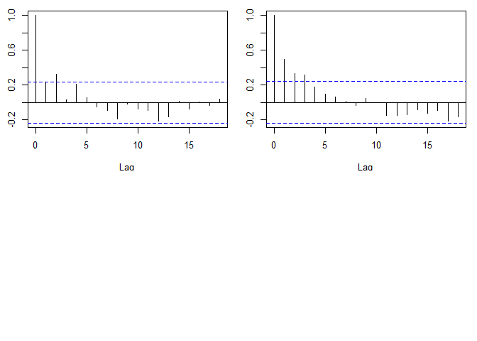<!-- -->

### unrate

Based on the plot of the realization, a constant mean assumption seems
reasonable. The parzen window and periodogram show system frequencies
near zero. The periodogram suggests that the peak may be just above 0,
possibly between 0.014 and 0.022. The sample autocorrelations are
positive and fall off by the 10th lag. The sample autocorrelations of
the first and second half of the realization apepar to be consistent.

AIC suggests a model with AR order of 4 or 5 with a moving avarege
component. However, an AR(3) fit to the realization appears to be
sufficient to reduce the realization to white noise. Additionally, the
fitted AR(3) as a root in the range suggested by the periodogram. Higher
order models (4-5), keep this root and add factors with roots relatively
far from the unit circle.

The true plots of the AR(3) fit appear to be consistent with the
behavior of the sample plots.

**Sample Plots**

``` r
vals <- plotts.sample.wge(data$unrate)
```

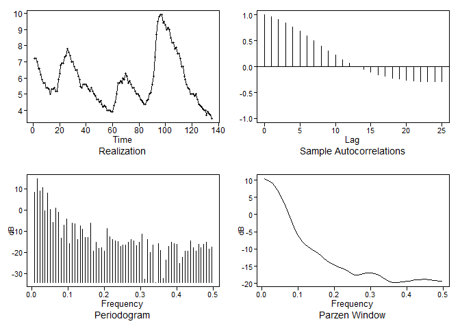<!-- -->

``` r
acf(data$unrate[1:68])
acf(data$unrate[69:135])
```

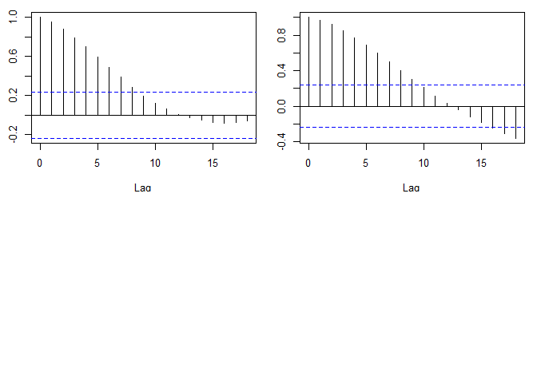<!-- -->

**Model Fits**

An AR(3) is fit below. The plot shows the behavior of the realization
and the result of differencing the realization with the AR(3) fit. The
resulting difference appears to be consistent with white noise.

``` r
aic5.wge(data$unrate)
```

    ## ---------WORKING... PLEASE WAIT... 
    ## 
    ## 
    ## Five Smallest Values of  aic

    ##       p    q        aic
    ## 18    5    2  -2.876830
    ## 14    4    1  -2.816447
    ## 15    4    2  -2.803668
    ## 17    5    1  -2.802325
    ## 8     2    1  -2.787907

``` r
est <- est.arma.wge(data$unrate, p = 3)
```

    ## 
    ## Coefficients of Original polynomial:  
    ## 1.3238 -0.0346 -0.3272 
    ## 
    ## Factor                 Roots                Abs Recip    System Freq 
    ## 1-1.7468B+0.7735B^2    1.1292+-0.1335i      0.8795       0.0187
    ## 1+0.4230B             -2.3640               0.4230       0.5000
    ##   
    ## 

``` r
vals <- artrans.wge(data$unrate, phi.tr = est$phi)
```

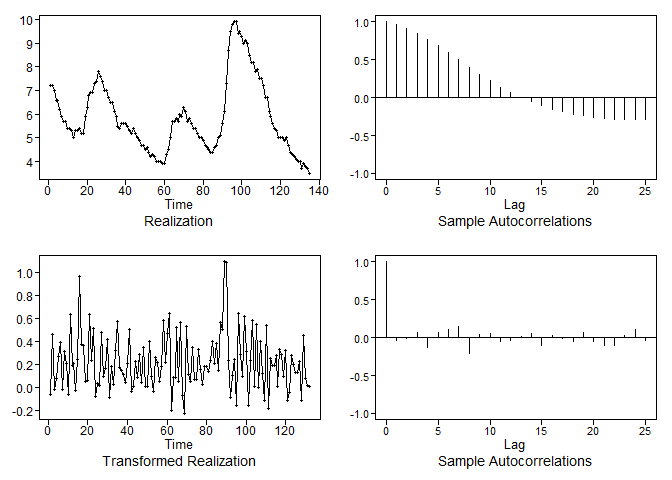<!-- -->

**True Plots of AR(3) Fit**

The true characteristics of the AR(3) fit is plotted below.

``` r
vals <- plotts.true.wge(135, phi = est$phi)
```

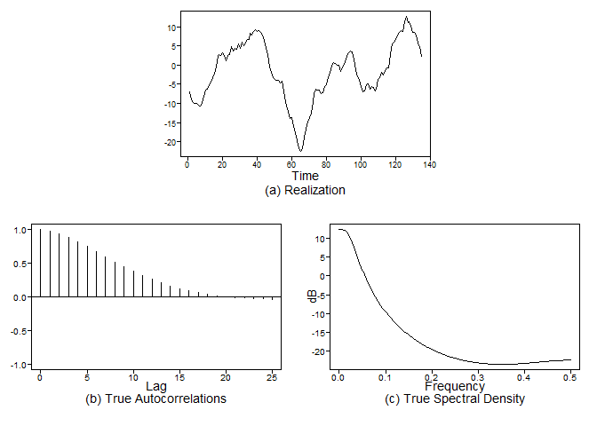<!-- -->

### nfjobs

The realization appears to wander with a upward trend. The periodgram
and parzen window show evidence of a dominate peak at zero. The sample
autocorrelations are positive and fall off slowly. These sample plots
appear to be consistent with a non-stationary time series with an upward
trend.

With the first difference taken, the result appears to be consistent
with an ARMA process. AIC suggests a noise structure of AR(3). An AR(3)
model fit appears to be sufficient to reduce the noise structure to
white noise.

An ARIMA(3,1,0) may be sufficient to model this realization.

**Sample Plots**

``` r
vals <- plotts.sample.wge(data$nfjobs)
```

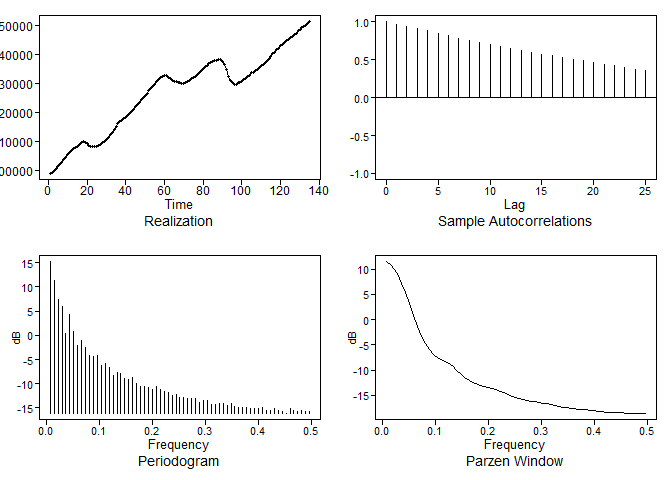<!-- -->

``` r
acf(data$nfjobs[1:68])
acf(data$nfjobs[69:135])
```

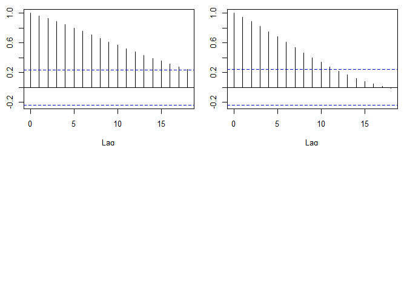<!-- -->

**Model Fit**

When the first difference is taken from the realization, the noise
structure appears to be consistent with an ARMA model. AIC suggests an
AR(3). When the fitted AR(3) is differenced with the noise, the result
appears to be white noise.

``` r
nfjobs.first.diff <- artrans.wge(data$nfjobs, phi.tr = c(1))
```

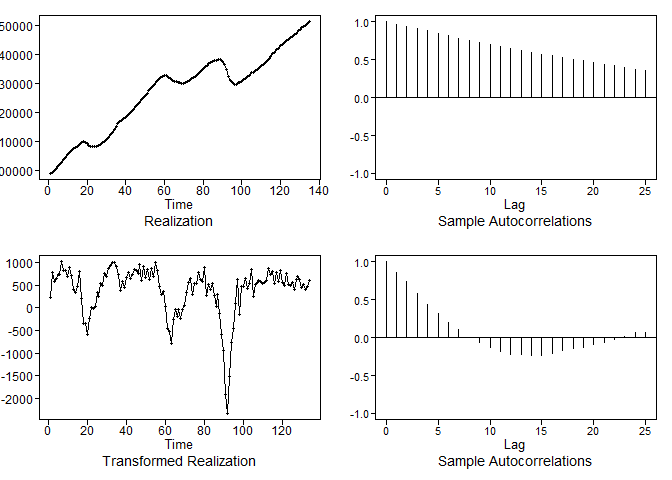<!-- -->

``` r
plotts.sample.wge(nfjobs.first.diff)
```

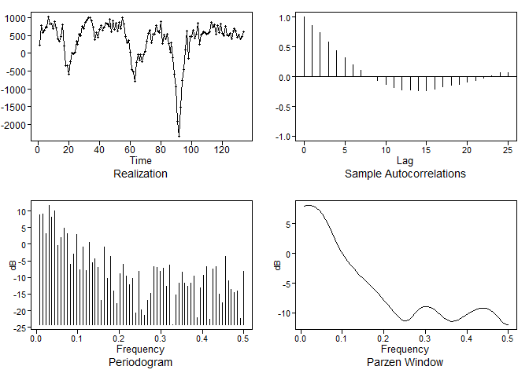<!-- -->

    ## $autplt
    ##  [1]  1.00000000  0.85810060  0.73629599  0.58402645  0.43744852  0.31321523
    ##  [7]  0.20679470  0.11457280 -0.00388365 -0.06557015 -0.12720345 -0.17876145
    ## [13] -0.21910103 -0.22372587 -0.23481412 -0.23406263 -0.21215105 -0.17531641
    ## [19] -0.14841574 -0.12716410 -0.08744396 -0.06921297 -0.01794801  0.01872713
    ## [25]  0.06919132  0.07268053
    ## 
    ## $freq
    ##  [1] 0.007462687 0.014925373 0.022388060 0.029850746 0.037313433 0.044776119
    ##  [7] 0.052238806 0.059701493 0.067164179 0.074626866 0.082089552 0.089552239
    ## [13] 0.097014925 0.104477612 0.111940299 0.119402985 0.126865672 0.134328358
    ## [19] 0.141791045 0.149253731 0.156716418 0.164179104 0.171641791 0.179104478
    ## [25] 0.186567164 0.194029851 0.201492537 0.208955224 0.216417910 0.223880597
    ## [31] 0.231343284 0.238805970 0.246268657 0.253731343 0.261194030 0.268656716
    ## [37] 0.276119403 0.283582090 0.291044776 0.298507463 0.305970149 0.313432836
    ## [43] 0.320895522 0.328358209 0.335820896 0.343283582 0.350746269 0.358208955
    ## [49] 0.365671642 0.373134328 0.380597015 0.388059701 0.395522388 0.402985075
    ## [55] 0.410447761 0.417910448 0.425373134 0.432835821 0.440298507 0.447761194
    ## [61] 0.455223881 0.462686567 0.470149254 0.477611940 0.485074627 0.492537313
    ## [67] 0.500000000
    ## 
    ## $db
    ##  [1]   8.7476425   8.9868580   3.1725841  11.5370117   8.0523554  10.0507440
    ##  [7]  -0.3228851   1.9338724   4.8084750   3.1331870  -5.9824275  -3.0208779
    ## [13]   2.8417081  -7.7383477  -0.8460293  -8.0168360   0.5720412  -5.5467975
    ## [19]  -4.4893818  -7.0137186 -16.9859326  -0.9124583 -10.3624216  -3.7877375
    ## [25] -14.1451992 -17.9362678  -8.9260476  -6.0823879  -9.4604740 -12.1017353
    ## [31] -10.3379745 -20.6139095  -8.2193690 -19.6481657 -21.3291214 -16.8714519
    ## [37] -14.8433161  -6.7467285  -7.0286750  -8.2198747  -7.2954192 -12.5799551
    ## [43]  -6.2836849 -24.1774663 -15.1657900 -11.8136606  -8.3224166 -11.8111798
    ## [49] -12.6084616 -11.7167764  -9.6473866 -22.1276546 -13.0616227  -9.2519105
    ## [55]  -6.6765530 -22.6533088  -7.3819811  -6.7064706 -14.9933078 -17.4827660
    ## [61]  -3.7554578 -11.0479278 -13.6701246 -14.5680753 -14.1570193 -22.2554324
    ## [67]  -8.0939871
    ## 
    ## $dbz
    ##  [1]   7.9902135   8.0257639   8.0253019   7.9266867   7.6767347   7.2398704
    ##  [7]   6.6002911   5.7626519   4.7540027   3.6264436   2.4559229   1.3294194
    ## [13]   0.3177611  -0.5510740  -1.2938684  -1.9475261  -2.5427838  -3.0954815
    ## [19]  -3.6134068  -4.1065323  -4.5912270  -5.0869614  -5.6098336  -6.1676098
    ## [25]  -6.7582899  -7.3721455  -7.9964693  -8.6213838  -9.2431032  -9.8595319
    ## [31] -10.4549137 -10.9774053 -11.3280076 -11.3945497 -11.1358823 -10.6341171
    ## [37] -10.0444317  -9.5095123  -9.1203243  -8.9191977  -8.9141809  -9.0899871
    ## [43]  -9.4138217  -9.8384040 -10.3050569 -10.7492642 -11.1096732 -11.3391461
    ## [49] -11.4142431 -11.3389954 -11.1407325 -10.8595510 -10.5364665 -10.2054966
    ## [55]  -9.8918968  -9.6152274  -9.3940159  -9.2488615  -9.2023724  -9.2761677
    ## [61]  -9.4860553  -9.8359962 -10.3103193 -10.8633609 -11.4089790 -11.8226486
    ## [67] -11.9789628

``` r
aic5.wge(nfjobs.first.diff)
```

    ## ---------WORKING... PLEASE WAIT... 
    ## 
    ## 
    ## Five Smallest Values of  aic

    ##       p    q        aic
    ## 10    3    0   11.27045
    ## 11    3    1   11.27502
    ## 6     1    2   11.27528
    ## 4     1    0   11.27583
    ## 13    4    0   11.27819

``` r
nfjobs.diff.model <- est.arma.wge(nfjobs.first.diff, p = 3)
```

    ## 
    ## Coefficients of Original polynomial:  
    ## 0.8588 0.1517 -0.1827 
    ## 
    ## Factor                 Roots                Abs Recip    System Freq 
    ## 1-0.7104B              1.4076               0.7104       0.0000
    ## 1-0.5867B              1.7046               0.5867       0.0000
    ## 1+0.4383B             -2.2817               0.4383       0.5000
    ##   
    ## 

``` r
vals <- artrans.wge(nfjobs.first.diff, phi.tr = nfjobs.diff.model$phi)
```

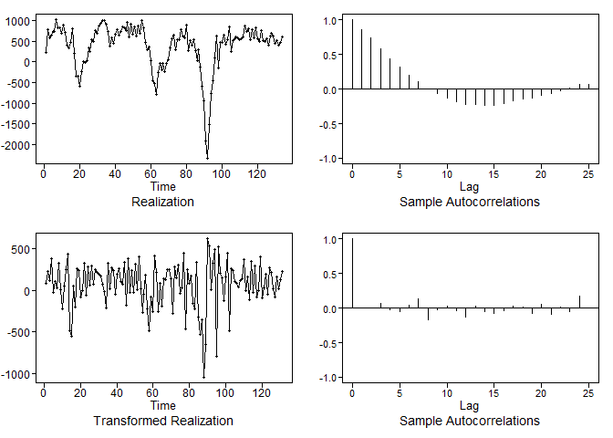<!-- -->

### treas10yr

This realization appears to trend downward. A constant mean assumption
does not appear to be reasonable for this realization. The sample
autocorrelations are positive and drop off slowly. The parzen window and
periodogram show evidence of a root at 0. These plots are consistent
with a non-stationary process.

An ARIMA(0,1,0) appears to be sufficient to model this realization. When
the first difference is taken, the result appears to be consistent with
white noise.

**Sample Plots**

``` r
vals <- plotts.sample.wge(data$treas10yr)
```

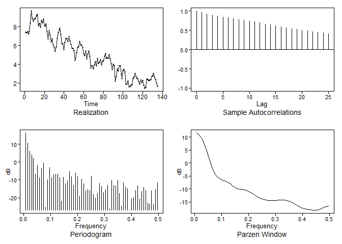<!-- -->

``` r
acf(data$treas10yr[1:68])
acf(data$treas10yr[69:135])
```

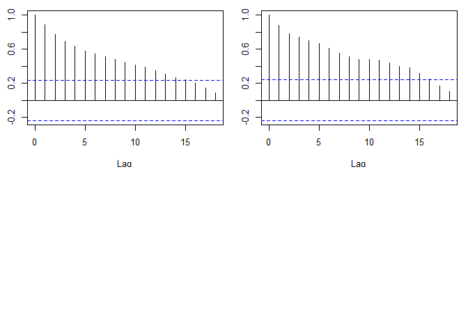<!-- -->

**Model Fit**

When the first difference is taken from the realization, the noise
structure appears to be consistent with an white noise.

``` r
treas10yr.first.diff <- artrans.wge(data$treas10yr, phi.tr = c(1))
```

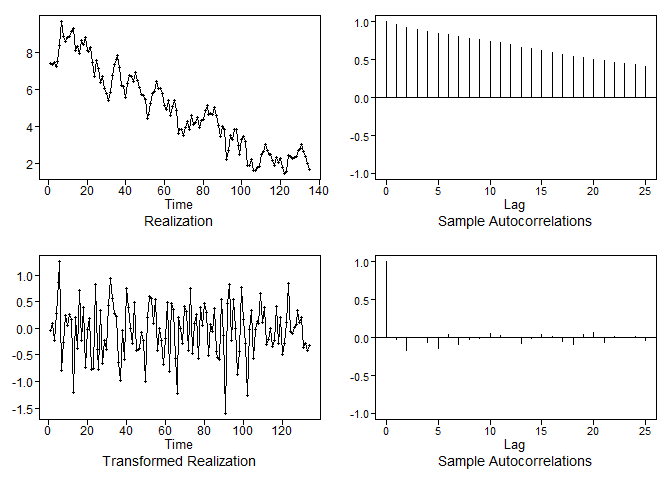<!-- -->

``` r
plotts.sample.wge(treas10yr.first.diff)
```

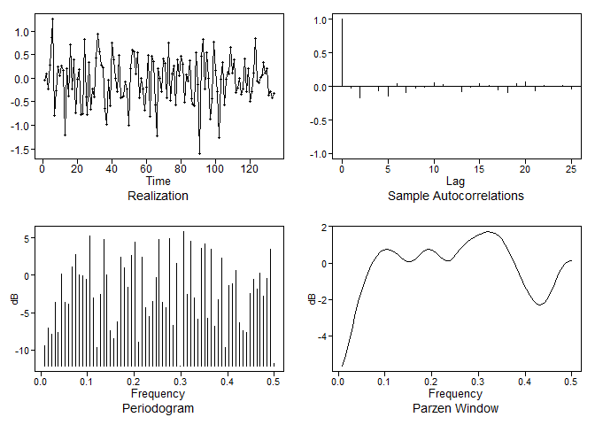<!-- -->

    ## $autplt
    ##  [1]  1.000000000 -0.026363404 -0.165055285  0.003719405 -0.060939992
    ##  [6] -0.142350676  0.042998456 -0.090287894 -0.024491516 -0.008916625
    ## [11]  0.050526098  0.031668904 -0.002427237 -0.077783289 -0.007397616
    ## [16]  0.045576501  0.011156800 -0.048834230 -0.087246570  0.046812969
    ## [21]  0.070457067 -0.068400513  0.014399020  0.008625057  0.014067922
    ## [26] -0.041722208
    ## 
    ## $freq
    ##  [1] 0.007462687 0.014925373 0.022388060 0.029850746 0.037313433 0.044776119
    ##  [7] 0.052238806 0.059701493 0.067164179 0.074626866 0.082089552 0.089552239
    ## [13] 0.097014925 0.104477612 0.111940299 0.119402985 0.126865672 0.134328358
    ## [19] 0.141791045 0.149253731 0.156716418 0.164179104 0.171641791 0.179104478
    ## [25] 0.186567164 0.194029851 0.201492537 0.208955224 0.216417910 0.223880597
    ## [31] 0.231343284 0.238805970 0.246268657 0.253731343 0.261194030 0.268656716
    ## [37] 0.276119403 0.283582090 0.291044776 0.298507463 0.305970149 0.313432836
    ## [43] 0.320895522 0.328358209 0.335820896 0.343283582 0.350746269 0.358208955
    ## [49] 0.365671642 0.373134328 0.380597015 0.388059701 0.395522388 0.402985075
    ## [55] 0.410447761 0.417910448 0.425373134 0.432835821 0.440298507 0.447761194
    ## [61] 0.455223881 0.462686567 0.470149254 0.477611940 0.485074627 0.492537313
    ## [67] 0.500000000
    ## 
    ## $db
    ##  [1]  -9.39317070  -7.07830109  -7.84556073  -3.66611542  -7.68108430
    ##  [6]   0.10652004  -3.60713218  -3.86646586   1.08005163   2.79722864
    ## [11]   0.08835111  -0.05789957  -0.56694372   5.29883771  -2.99163502
    ## [16]  -9.67703391  -2.52950382   4.79508341   0.06189730  -7.41599010
    ## [21]  -8.50404512  -6.26854479   2.43892715   0.95706555  -1.62411128
    ## [26]   2.70693192   4.47416574  -8.97306379   2.42025111  -4.36719546
    ## [31]  -5.51345317  -3.45335077  -0.35563751   4.83268444  -3.58146323
    ## [36]  -4.37209072   4.92339562  -6.73625507   1.53700451 -12.14495473
    ## [41]   5.79433583  -2.56505205   4.51386730  -2.98450543  -5.89198755
    ## [46]   3.55493734   4.19064038  -5.70279446   3.52334806  -6.82702707
    ## [51]  -3.22510897   2.34555577  -9.62330209  -1.40218484  -1.09106758
    ## [56]   0.61385229  -6.30621533  -7.45689407  -7.61038596  -2.44294198
    ## [61]  -0.57838218  -1.86113242   0.23178254  -2.83173326  -0.45390143
    ## [66]   3.48646521 -11.77063934
    ## 
    ## $dbz
    ##  [1] -5.66123742 -5.07066537 -4.29166592 -3.47336101 -2.69656096 -1.99073679
    ##  [7] -1.36062897 -0.80479378 -0.32452158  0.07453474  0.38488663  0.60091612
    ## [13]  0.72176264  0.75264886  0.70488366  0.59534035  0.44632673  0.28616522
    ## [19]  0.14919001  0.07192225  0.08257579  0.18663903  0.35857401  0.54811480
    ## [25]  0.69797767  0.76238410  0.71983694  0.58009290  0.38594628  0.20594140
    ## [31]  0.11181368  0.14506418  0.29628412  0.51706386  0.75205280  0.96377988
    ## [37]  1.13908987  1.28240598  1.40431595  1.51183082  1.60390195  1.67242637
    ## [43]  1.70605076  1.69355230  1.62531900  1.49350684  1.29231293  1.01934594
    ## [49]  0.67796955  0.27947072 -0.15657886 -0.60498161 -1.04010028 -1.44051885
    ## [55] -1.78906350 -2.06712993 -2.24832551 -2.30015518 -2.19826329 -1.94529799
    ## [61] -1.57778797 -1.15415361 -0.73484478 -0.36856844 -0.08837120  0.08620861
    ## [67]  0.14537603

### treas3mo

This realization appears to be consistent with a downward trend with
wandering or psuedo-periodic behavior. The autocorrelations are positive
and decrease relatively quickly was the lags increase. However, the
autocorrelations do not go to zero, which could suggest a non-stationary
process. The ACF for the first and second half of the realization appear
to be similar. When the ACF is calculated on half of the realization,
the ACF apprears as damped exponentials in a sinusiodal envolope. This
is typically evidence of an AR process with a complex root.

Since there appears to be a downward trend, a linear model was fit and
the downward trend was removed (however, we would not expect a negative
treasury yield). The resulting series appears to be consistent with an
AR process with a complex root - pseudo-periodic behavior is present and
the ACF are damped exponentials in a sinusiodal envolope. An ARMA(2,1)
was suggested by AIC for the noise structure. When the AR(2) portion of
the ARMA(2,1) fit to the noise is removed from the noise, the results is
consistent with an MA(1).

**Sample Plots**

``` r
vals <- plotts.sample.wge(data$treas3mo)
```

<!-- -->

``` r
acf(data$treas3mo[1:68])
acf(data$treas3mo[69:135])
```

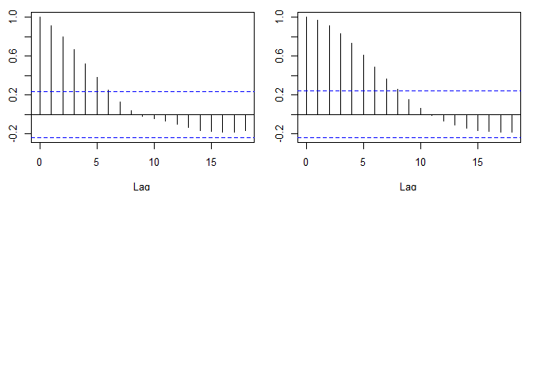<!-- -->

**Model Fit**

When a linear model is fit, the resulting noise structure appear to be
consistent with an ARMA process with a complex AR root. A ARMA(2,1) was
suggested by AIC. When the AR(2) portion of the model is removed, the
resulting noise appears to be consistent with an MA(1).

``` r
lin.model <- lm(data$treas3mo ~ seq_along(data$treas3mo))
plotts.sample.wge(lin.model$residuals)
```

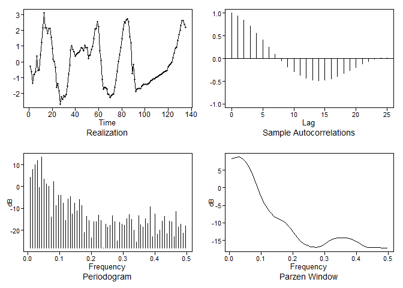<!-- -->

    ## $autplt
    ##  [1]  1.00000000  0.94023639  0.84652083  0.71732832  0.56276237  0.41038248
    ##  [7]  0.25267305  0.09212126 -0.05266169 -0.18114794 -0.28604745 -0.36688910
    ## [13] -0.42758644 -0.46694966 -0.48638861 -0.47573985 -0.44315300 -0.39379744
    ## [19] -0.32851079 -0.25978751 -0.19210441 -0.12103369 -0.06230445 -0.01407123
    ## [25]  0.01420941  0.02216446
    ## 
    ## $freq
    ##  [1] 0.007407407 0.014814815 0.022222222 0.029629630 0.037037037 0.044444444
    ##  [7] 0.051851852 0.059259259 0.066666667 0.074074074 0.081481481 0.088888889
    ## [13] 0.096296296 0.103703704 0.111111111 0.118518519 0.125925926 0.133333333
    ## [19] 0.140740741 0.148148148 0.155555556 0.162962963 0.170370370 0.177777778
    ## [25] 0.185185185 0.192592593 0.200000000 0.207407407 0.214814815 0.222222222
    ## [31] 0.229629630 0.237037037 0.244444444 0.251851852 0.259259259 0.266666667
    ## [37] 0.274074074 0.281481481 0.288888889 0.296296296 0.303703704 0.311111111
    ## [43] 0.318518519 0.325925926 0.333333333 0.340740741 0.348148148 0.355555556
    ## [49] 0.362962963 0.370370370 0.377777778 0.385185185 0.392592593 0.400000000
    ## [55] 0.407407407 0.414814815 0.422222222 0.429629630 0.437037037 0.444444444
    ## [61] 0.451851852 0.459259259 0.466666667 0.474074074 0.481481481 0.488888889
    ## [67] 0.496296296
    ## 
    ## $db
    ##  [1]   4.3563517   7.8090559   9.9545026  11.9354468  -0.3463121  13.4962287
    ##  [7]   3.4245982   1.3124595   0.1017819 -13.8918744   2.4565016  -8.7823000
    ## [13]  -3.9731113  -4.0092396  -7.6379370 -15.4633870  -5.6954674  -4.5703892
    ## [19] -12.6192615  -7.4808032 -11.2836926  -5.9141248  -8.7307152 -21.1063666
    ## [25] -13.6744395 -15.6077732 -23.5796632 -16.2358171 -16.1953634 -13.0611279
    ## [31] -15.6806298 -28.2177787 -17.3586739 -18.4965037 -17.8755540 -13.3565919
    ## [37] -16.1936094 -24.9556558 -16.2891909 -17.2919148 -17.8774729 -14.6784880
    ## [43] -12.8586942 -15.1493330 -20.0390169 -25.3905758 -13.2947523 -17.5450977
    ## [49] -18.4937626 -14.8639111 -17.0486229  -9.1325544 -23.1136882 -12.4291670
    ## [55] -21.9831063 -19.9834425 -15.8073182 -13.6892978 -21.6263077 -15.9296655
    ## [61] -16.0134040 -22.9690451 -11.4678710 -18.7022789 -17.1846532 -21.3855547
    ## [67] -18.1339743
    ## 
    ## $dbz
    ##  [1]   8.263770614   8.447493768   8.626431872   8.685070665   8.537012777
    ##  [6]   8.128509458   7.430709664   6.433109873   5.142576374   3.589198977
    ## [11]   1.838493496   0.003120947  -1.767215391  -3.341163041  -4.673960070
    ## [16]  -5.800914887  -6.756772265  -7.527131564  -8.086294201  -8.465535892
    ## [21]  -8.762174646  -9.086652325  -9.515814462 -10.082872915 -10.788273209
    ## [26] -11.612213177 -12.519796240 -13.458010897 -14.352312327 -15.118559269
    ## [31] -15.698740437 -16.095930850 -16.367429474 -16.578959025 -16.762910086
    ## [36] -16.905556005 -16.960446403 -16.878165045 -16.638713179 -16.267231898
    ## [41] -15.823298127 -15.375356745 -14.978846501 -14.665964480 -14.445142787
    ## [46] -14.306553663 -14.231449534 -14.203208138 -14.216275527 -14.278759888
    ## [51] -14.407486961 -14.618582974 -14.918037472 -15.295056781 -15.719432085
    ## [56] -16.144373730 -16.516797027 -16.794311136 -16.961331564 -17.033293728
    ## [61] -17.045853192 -17.037623853 -17.036807300 -17.055526081 -17.090561457
    ## [66] -17.128360647 -17.152674153

``` r
aic5.wge(lin.model$residuals)
```

    ## ---------WORKING... PLEASE WAIT... 
    ## 
    ## 
    ## Five Smallest Values of  aic

    ##       p    q        aic
    ## 8     2    1  -1.752957
    ## 13    4    0  -1.751927
    ## 15    4    2  -1.747133
    ## 14    4    1  -1.746633
    ## 11    3    1  -1.745400

``` r
est <- est.arma.wge(lin.model$residuals, p = 2, q = 1)
```

    ## 
    ## Coefficients of Original polynomial:  
    ## 1.8714 -0.9154 
    ## 
    ## Factor                 Roots                Abs Recip    System Freq 
    ## 1-1.8714B+0.9154B^2    1.0222+-0.2182i      0.9568       0.0335
    ##   
    ## 

``` r
artrans.wge(lin.model$residuals, phi.tr = est$phi)
```

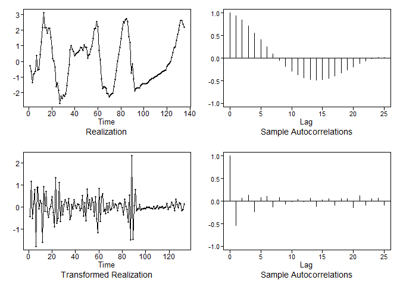<!-- -->

    ##   [1] -0.4460281291  1.1585323922 -0.5192686955  0.1264657907  0.7876202705
    ##   [6] -1.7918597174  0.8778718882  0.8735581334 -0.0791880747  0.2796160925
    ##  [11]  0.1542292026 -1.6172667179  0.9075410678 -0.2083491634  0.7018756787
    ##  [16] -0.2189106934 -0.4684223722 -0.0912004390  0.0092501486  0.4528658920
    ##  [21] -0.2517426969 -0.8995233906  1.3136672479 -0.7295745634 -0.5176278338
    ##  [26]  1.1112439611 -0.6588272728  0.2339410811 -0.3475091333  0.1067001724
    ##  [31]  0.3207640670  0.1885123373 -0.1305688149  0.3820029999 -0.5681553496
    ##  [36] -0.4145454305  0.0948533225 -0.0848482821  0.3258191215  0.0473939055
    ##  [41] -0.0563777509  0.1365820562  0.1113051603 -0.1842741398 -0.0566462538
    ##  [46]  0.5097098763 -0.4232922407  0.1679364134 -0.6305255792  0.7929875723
    ##  [51] -0.0687681515  0.3055468513 -0.1256621413  0.4050007975  0.2067579372
    ##  [56] -0.4082332222  0.4475701844 -0.5450751272 -1.1760844754  0.8404978532
    ##  [61] -0.6462562006  0.4402864141  0.5834810644 -0.2019145205 -0.1153860891
    ##  [66] -0.3021583381  0.1561554796 -0.2521886130  0.1760440813 -0.1348847646
    ##  [71] -0.0867798568  0.2955552011 -0.0332312851  0.1158330879  0.0816190380
    ##  [76] -0.1758757513  0.1319689506  0.1895625443  0.1345369246 -0.0272224751
    ##  [81] -0.3525406124  0.3522100027  0.0214189979 -0.1146717842 -0.6823268398
    ##  [86]  0.5299933629 -1.5022372343  2.3043327235 -1.4589319661  0.0433545653
    ##  [91]  0.7644122776 -0.1818614811 -0.1005592738 -0.1029635317  0.1033114751
    ##  [96] -0.1347224753 -0.0982751673 -0.0802047198 -0.0513227025 -0.0894623500
    ## [101] -0.0123068530 -0.0461818902 -0.0030008023 -0.0742343686 -0.0535569106
    ## [106] -0.1016276376  0.0234300145 -0.0874322272 -0.0306480548  0.0316525428
    ## [111] -0.0978889635 -0.0223566060 -0.0396157633  0.0109927743 -0.0524075575
    ## [116] -0.0330508348 -0.0124422972  0.1502985456 -0.1059399640 -0.0007100107
    ## [121] -0.0161737272  0.1957900061  0.0638850273  0.0697643036 -0.1743219598
    ## [126]  0.3490291129  0.1012731609 -0.0305774166  0.1687181237  0.1275757352
    ## [131] -0.1686428334 -0.1147359319  0.1258135717

### treas10yr3mo

This realization appears to be consistent with an AR process with a
complex root.

**Sample Plots**

``` r
vals <- plotts.sample.wge(data$treas10yr3mo)
```

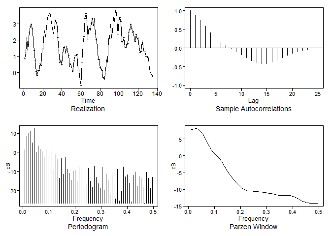<!-- -->

``` r
acf(data$treas10yr3mo[1:68])
acf(data$treas10yr3mo[69:135])
```

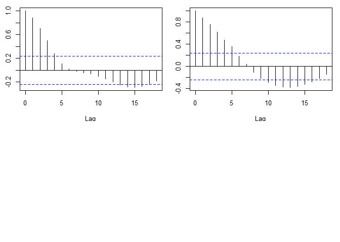<!-- -->

**Model Fit**

A AR(3) model is suggested by AIC. A AR(3) appears to be sufficient to
model is realization. When the fitted AR(3) is removed from the
realization, the result appears to be consistent with white noise.

``` r
aic5.wge(data$treas10yr3mo)
```

    ## ---------WORKING... PLEASE WAIT... 
    ## 
    ## 
    ## Five Smallest Values of  aic

    ##       p    q        aic
    ## 10    3    0  -1.453501
    ## 13    4    0  -1.449416
    ## 7     2    0  -1.437387
    ## 14    4    1  -1.436171
    ## 16    5    0  -1.436059

``` r
est <- est.arma.wge(data$treas10yr3mo, p = 3)
```

    ## 
    ## Coefficients of Original polynomial:  
    ## 1.0769 -0.0485 -0.1704 
    ## 
    ## Factor                 Roots                Abs Recip    System Freq 
    ## 1-1.4080B+0.5147B^2    1.3677+-0.2687i      0.7174       0.0309
    ## 1+0.3311B             -3.0203               0.3311       0.5000
    ##   
    ## 

``` r
artrans.wge(data$treas10yr3mo, phi.tr = est$phi)
```

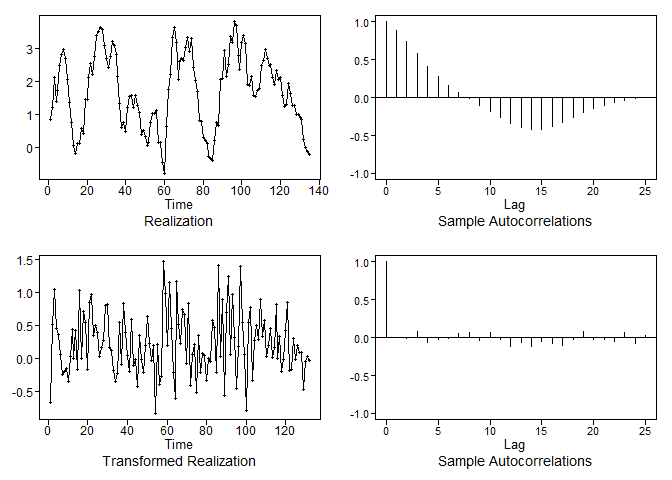<!-- -->

    ##   [1] -0.666398332  0.522725064  1.045340144  0.462228227  0.367803111
    ##   [6]  0.058569890 -0.236187036 -0.190361223 -0.156428156 -0.342837267
    ##  [11]  0.037175150  0.436919218 -0.005828953  0.419050906 -0.166114986
    ##  [16]  1.037257127  0.008266359  0.712213810  0.553776493 -0.163961189
    ##  [21]  0.855936175  0.967066256  0.349551742  0.494957895  0.398888788
    ##  [26]  0.027621287  0.172503127  0.266967496  0.809946180  0.815462411
    ##  [31]  0.169660488  0.129438242 -0.180198781 -0.344245020 -0.226026662
    ##  [36]  0.545294445 -0.094619590  0.834438290  0.401519989  0.051399127
    ##  [41] -0.199996467  0.597072804 -0.102190466 -0.012725733 -0.422753623
    ##  [46]  0.356205495 -0.009623543 -0.204913843  0.198037490  0.638274168
    ##  [51]  0.231766286 -0.023305928  0.201116336 -0.831041770  0.216663827
    ##  [56] -0.393377650 -0.274105491  1.463874460  0.980920885  0.193311260
    ##  [61]  1.154184295  0.452481716 -0.212446243 -0.599184496  1.163675764
    ##  [66]  0.517910677  0.220996328  0.742453709  0.665221521 -0.069166926
    ##  [71]  0.830449149 -0.405829294  0.058844543  0.213373382 -0.519262160
    ##  [76]  0.344993757 -0.209984999  0.072559614  0.042001093 -0.336766238
    ##  [81]  0.005207628 -0.044448971  0.572323696  0.472098299 -0.205454045
    ##  [86]  1.410897865  0.025126882  0.895721998 -0.560986912  0.693915560
    ##  [91]  1.251051986  0.059330488  0.964521593  0.321768590 -0.448653455
    ##  [96]  0.190074612  1.390409969  0.546091341  0.068459661 -0.786113835
    ## [101]  0.552883181  0.775317767 -0.331453587  0.272090090  0.505664785
    ## [106]  0.281529763  0.889773983  0.331581459  0.575757229  0.031536948
    ## [111]  0.194674558  0.454848844  0.015435822  0.161980198  0.812634285
    ## [116] -0.004150451  0.330750437 -0.203403065 -0.007188435  0.421254114
    ## [121]  0.856574766 -0.175907793 -0.168635666  0.301837371 -0.015994367
    ## [126]  0.202152993  0.097828472  0.090436765 -0.469320106 -0.049916066
    ## [131]  0.027442299 -0.029390348

### fedintrate

The behavior of this realization appear to be correlated to `treas3mo`.
The scatter plot of `fedintrate` vs `treas3mo` shows that there is a
strong correlation between the two variables, \(\rho = 0.994\)

**Sample Plots**

``` r
vals <- plotts.sample.wge(data$fedintrate)
```

<!-- -->

``` r
acf(data$fedintrate[1:68])
acf(data$fedintrate[69:135])

lm.fedtreas3mo <- lm(data$fedintrate ~ data$treas3mo)
plot(data$fedintrate, data$treas3mo)
cor(data$fedintrate, data$treas3mo)
```

    ## [1] 0.9942307

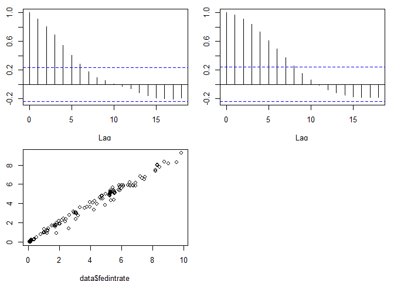<!-- -->

### libor3mo

Like `fedintrate`, `libor3mo` appears to be highly correlated to
`treas3mo`, \(\rho = 0.990\).

**Sample Plots**

``` r
vals <- plotts.sample.wge(data$libor3mo)
```

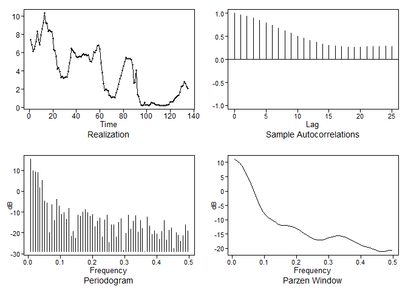<!-- -->

``` r
acf(data$libor3mo[1:68])
acf(data$libor3mo[69:135])

lm.fedtreas3mo <- lm(data$libor3mo ~ data$treas3mo)
plot(data$libor3mo, data$treas3mo)
cor(data$libor3mo, data$treas3mo)
```

    ## [1] 0.9909141

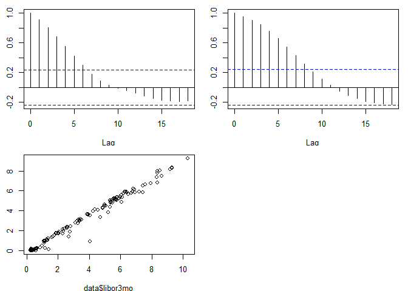<!-- -->

### personincomechg

The sample plots seem to suggest an ARMA process with more than one
complex autoregressive root. BIC suggests a model order of ARMA(5,0).
When a fitted AR(5) model is removed from the realization, the result
appears to be consistent with white noise.

**Sample Plots**

``` r
vals <- plotts.sample.wge(data$personincomechg)
```

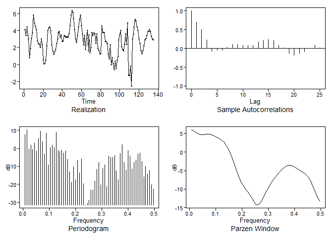<!-- -->

``` r
acf(data$personincomechg[1:68])
acf(data$personincomechg[69:135])
```

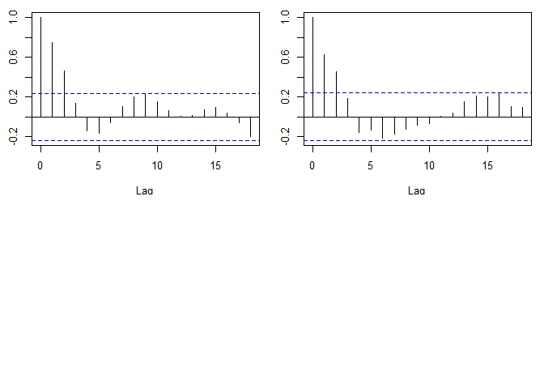<!-- -->

**Model Fit**

A AR(5) model is suggested by BIC. When the fitted AR(5) is removed from
the realization, the result appears to be consistent with white noise.

``` r
aic5.wge(data$personincomechg, p = 0:10, type = 'bic')
```

    ## ---------WORKING... PLEASE WAIT... 
    ## 
    ## 
    ## Five Smallest Values of  bic

    ##       p    q        bic
    ## 16    5    0 0.09867278
    ## 26    8    1 0.11675617
    ## 19    6    0 0.12730498
    ## 17    5    1 0.12959441
    ## 14    4    1 0.14310161

``` r
est <- est.arma.wge(data$personincomechg, p = 5)
```

    ## 
    ## Coefficients of Original polynomial:  
    ## 0.7277 0.2854 -0.1482 -0.5545 0.3989 
    ## 
    ## Factor                 Roots                Abs Recip    System Freq 
    ## 1+1.3228B+0.7502B^2   -0.8817+-0.7454i      0.8661       0.3883
    ## 1-1.2812B+0.6912B^2    0.9267+-0.7667i      0.8314       0.1100
    ## 1-0.7694B              1.2998               0.7694       0.0000
    ##   
    ## 

``` r
artrans.wge(data$personincomechg, phi.tr = est$phi)
```

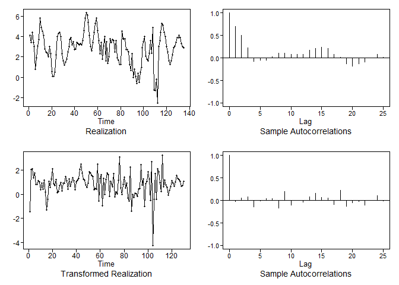<!-- -->

    ##   [1] -1.451804495  2.048849096  2.063493628  1.327462898  1.751142526
    ##   [6]  0.817123471  0.788239490  1.101312888  0.998199367  0.362312173
    ##  [11]  0.929584381  0.433106964  1.147037149  0.170927206 -1.300083281
    ##  [16] -0.396915947  1.062378644  0.566076964  1.237554151  2.087248839
    ##  [21]  0.850980340  0.692712124  1.184094064  0.110953298  0.225290130
    ##  [26]  0.696307070  0.973547730  0.282625165  0.909487062  0.916400728
    ##  [31]  1.423157481  1.121465763  0.418707242  1.272745495  0.672487575
    ##  [36]  0.996954666  1.329019307  1.090898298  0.344011472  1.008828854
    ##  [41]  1.142563266  1.277170521  2.013887283  2.452547221  1.757856844
    ##  [46]  1.261427998  1.137008527  0.744004006  0.558664233  0.916034757
    ##  [51]  1.820038538  1.747451550  1.540867259  1.436149053  0.366799161
    ##  [56]  0.466062803  0.410400346  2.482162596 -0.560364064  1.321681012
    ##  [61]  1.573376315 -0.961115848  1.295232635 -0.010062371  1.200688680
    ##  [66]  1.755125578  1.573758644 -0.182268672  1.050751811  0.637319942
    ##  [71]  1.670927142 -0.204556961  0.180515943  0.004171037  1.149154077
    ##  [76]  3.052236737  0.531572562 -0.014207333  0.819330645  1.389899404
    ##  [81]  0.525662127  0.918822574 -0.298642788 -0.578228083  2.210034202
    ##  [86] -1.371808366 -0.029144734 -0.271824152  0.094957720  0.009090789
    ##  [91] -0.161470317  0.397094408  0.465527815  2.416656008  0.741546003
    ##  [96]  1.250323229 -1.024896591  0.858013177  1.067325807  1.854792688
    ## [101]  1.232278986 -0.507273508  2.650879617 -4.224774051 -0.430751525
    ## [106]  1.709155295 -0.401852271  2.063564863  1.858553934  0.961372715
    ## [111]  0.208912853  3.181721375  0.627518622  1.131576469  0.772655878
    ## [116]  0.540848978 -0.077542326  0.329362850  0.635519337  1.091146502
    ## [121]  0.924896295  0.681433468  1.011067689  1.552412960  1.281350076
    ## [126]  1.214761366  1.029866748  0.675889717  0.699761915  1.070553277

### corpprofitchg

The sample plots appear to be consistent with white noise. Additionally,
the model chosen by AIC is an ARMA(0,0), which is consistent with white
noise.

**Sample Plots**

``` r
vals <- plotts.sample.wge(data$corpprofitchg)
```

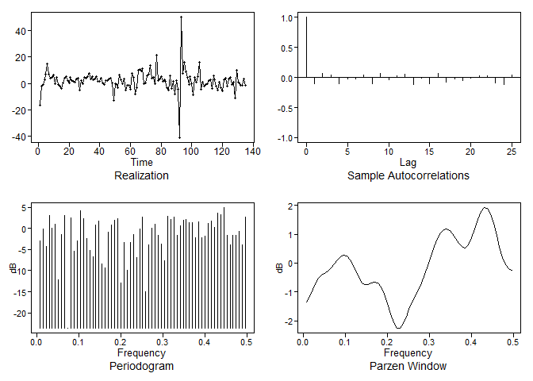<!-- -->

``` r
acf(data$corpprofitchg[1:68])
acf(data$corpprofitchg[69:135])
aic5.wge(data$corpprofitchg, p = 0:5)
```

    ## ---------WORKING... PLEASE WAIT... 
    ## 
    ## 
    ## Five Smallest Values of  aic

    ##      p    q        aic
    ## 1    0    0   4.092074
    ## 4    1    0   4.094418
    ## 2    0    1   4.095979
    ## 3    0    2   4.103274
    ## 7    2    0   4.105762

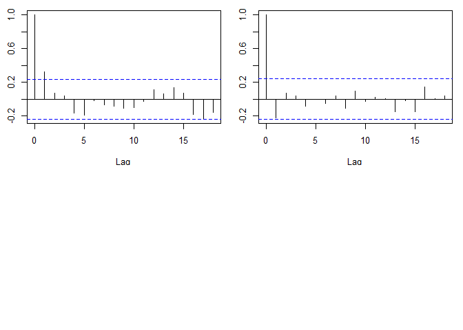<!-- -->

## Multivariate

Look at correlation between gdp and lags of the other variables.

### GDP Change vs Unemployment Rate

There is evidence of a weak correlation between `gdp_change` and the
first 10 lags of `unrate`.

``` r
plot.cross.lags(data, 'gdp_change', 'unrate', 19)
```

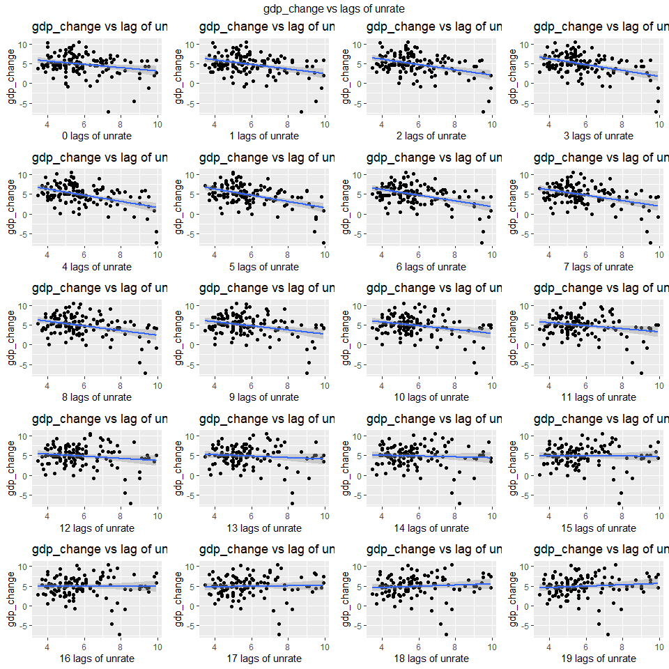<!-- -->

### GDP Change vs Non-farm Jobs

There is evidence of a weak correlation between `gdp_change` and the
first 10 lags of `nfjobs`.

``` r
plot.cross.lags(data, 'gdp_change', 'nfjobs', 19)
```

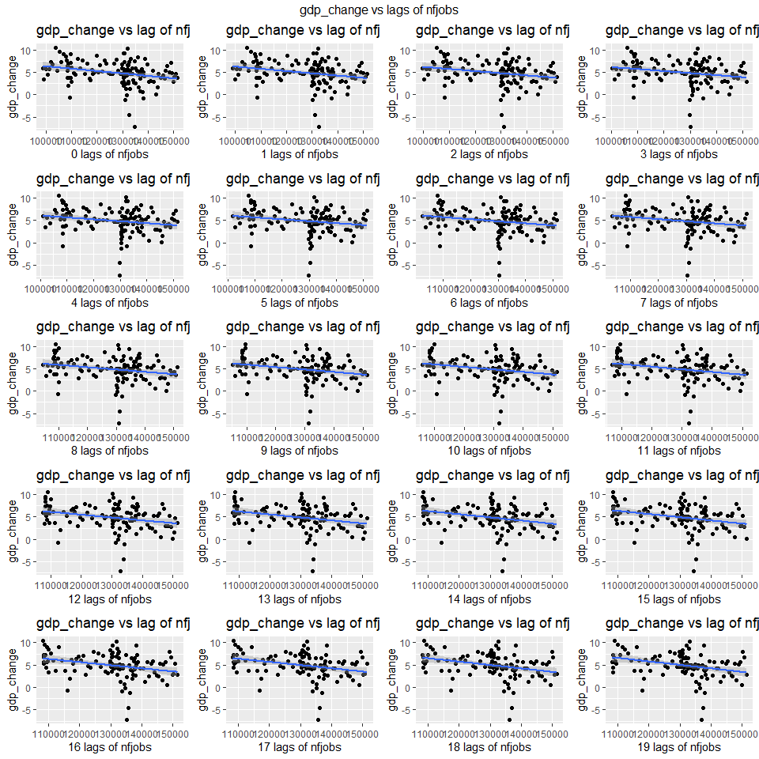<!-- -->

### GDP Change vs 10 Year Treasury Yield

There is evidence of a weak correlation between `gdp_change` and the
first 10 lags of `treas10yr`.

``` r
plot.cross.lags(data, 'gdp_change', 'treas10yr', 19)
```

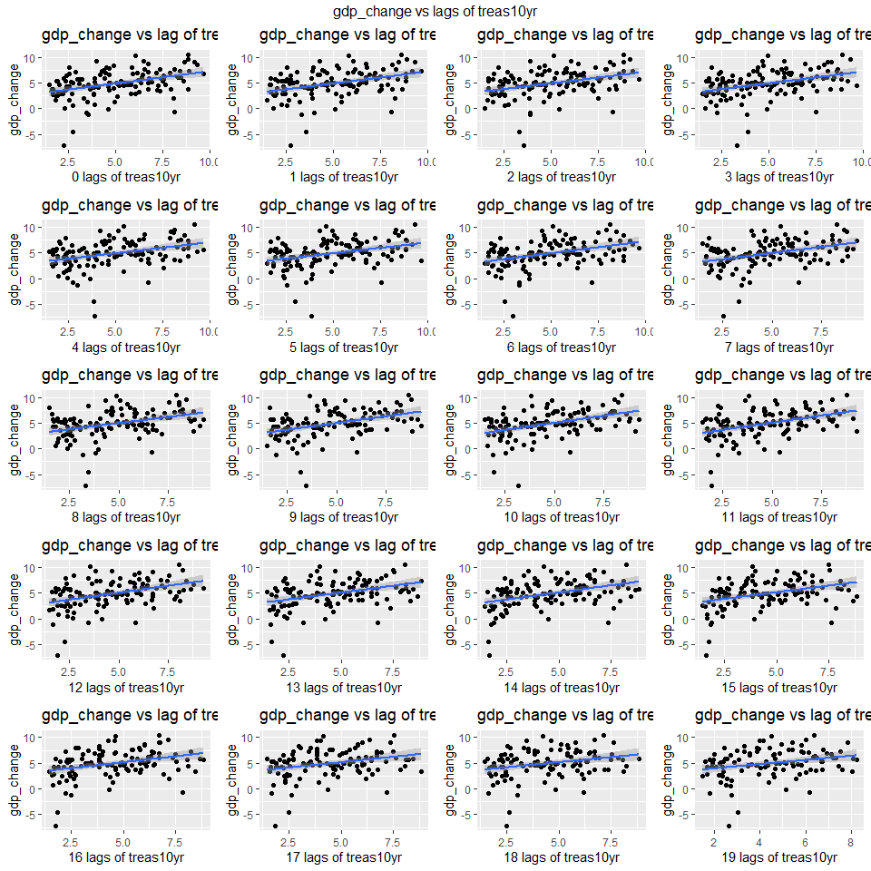<!-- -->

### GDP Change vs 3 Month Treasury Yield

There is evidence of a weak correlation between `gdp_change` and the
first 10 lags of `treas3mo`.

``` r
plot.cross.lags(data, 'gdp_change', 'treas3mo', 19)
```

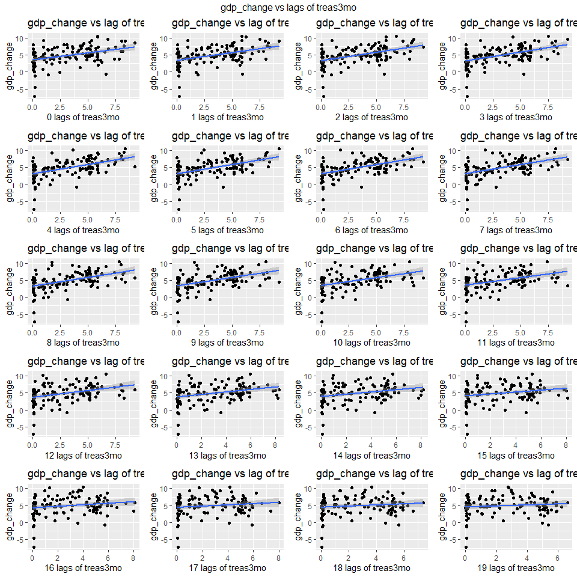<!-- -->

### GDP Change vs Treasury Yield 10 Year 3 Month Difference

There is evidence of a weak correlation between `gdp_change` and the 2nd
and 8th lags of `treas10yr3mo`.

``` r
plot.cross.lags(data, 'gdp_change', 'treas10yr3mo', 19)
```

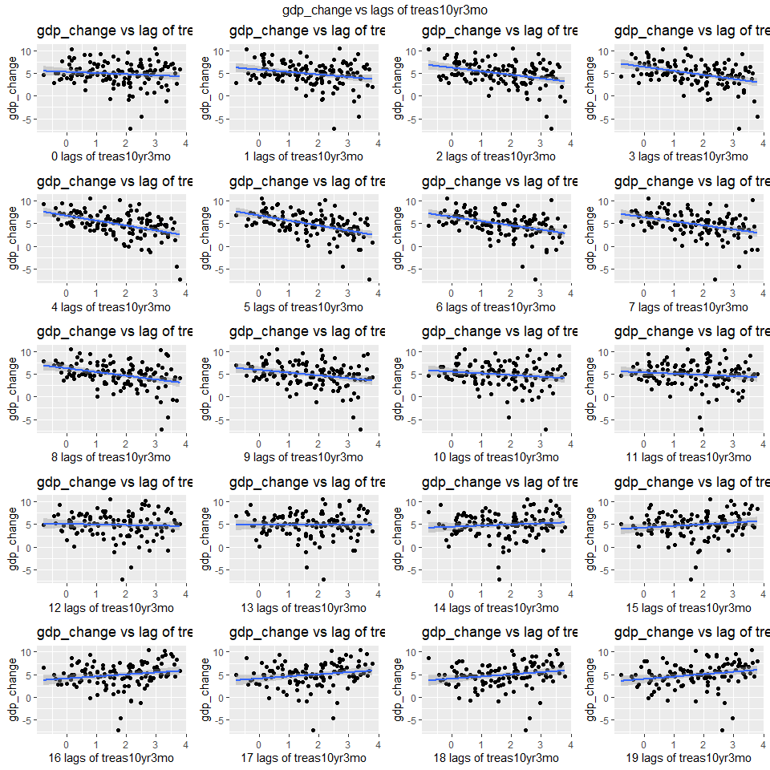<!-- -->

### GDP Change vs Federal Interest Rate

There is evidence of a weak correlation between `gdp_change` and the
first 10 lags of `fedintrate`.

``` r
plot.cross.lags(data, 'gdp_change', 'fedintrate', 19)
```

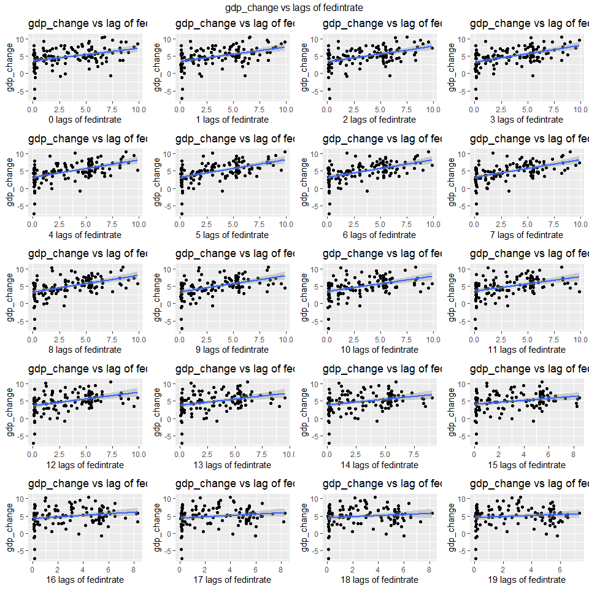<!-- -->

### GDP Change vs 3 Month LIBOR

There is evidence of a weak correlation between `gdp_change` and the
first 10 lags of `libor3mo`.

``` r
plot.cross.lags(data, 'gdp_change', 'libor3mo', 19)
```

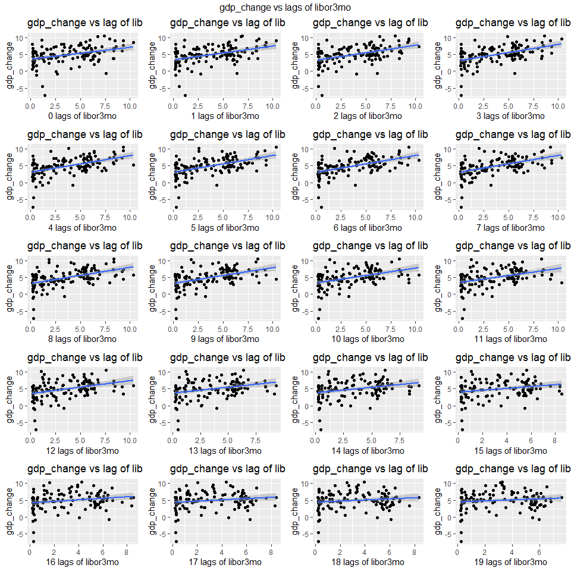<!-- -->

### GDP Change vs Change in Personal Income

There is evidence of a weak correlation between `gdp_change` and the
first 4 lags of `personincomechg`.

``` r
plot.cross.lags(data, 'gdp_change', 'personincomechg', 19)
```

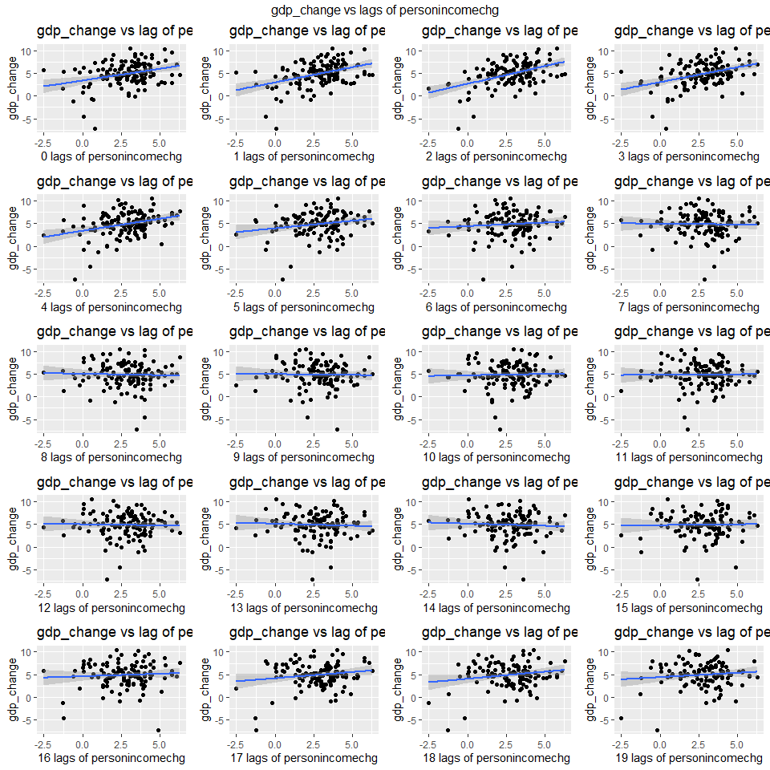<!-- -->

### GDP Change vs Change in Corparate Profits

There does not seem to be a correlation between change in GDP and lags
of change in corparate profits.

``` r
plot.cross.lags(data, 'gdp_change', 'corpprofitchg', 19)
```

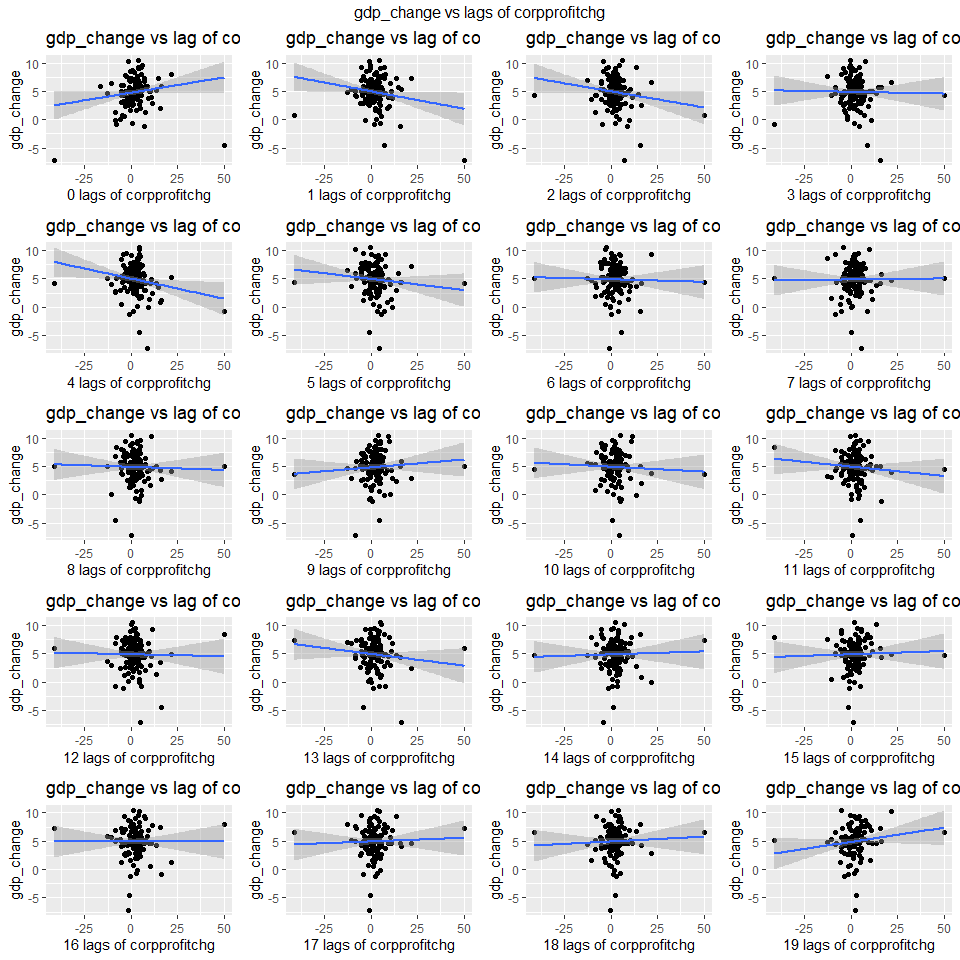<!-- -->

### Explanatory Variables

There is strong evidence of linear relationships between `fedintrate`,
`libor3mo`, and `treas3mo`. `corpprofitchg` does not seem to be
correlated to anything.

``` r
data %>%
  select(-c('date', 'gdp_change')) %>%
  ggpairs()
```

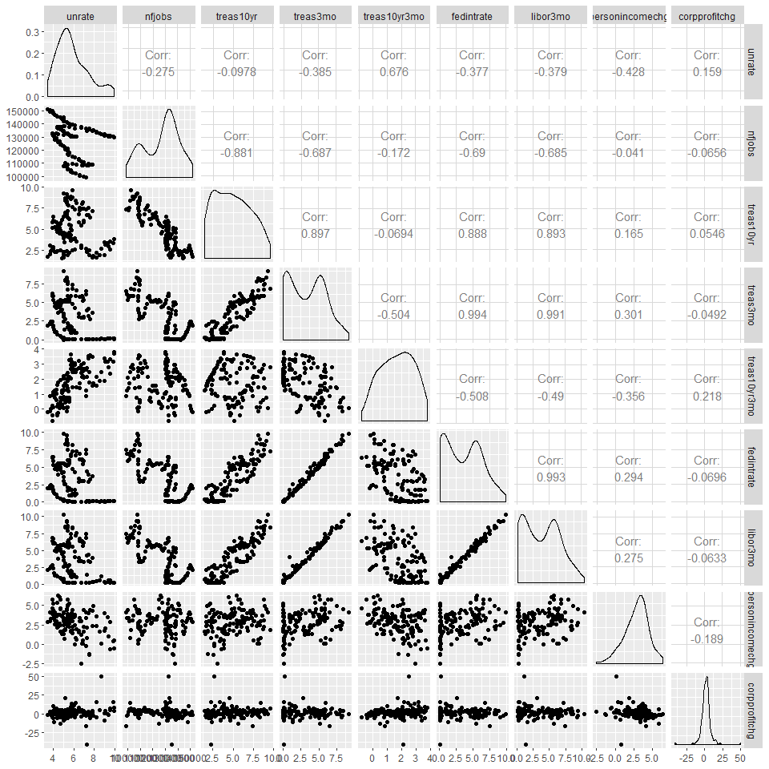<!-- -->
