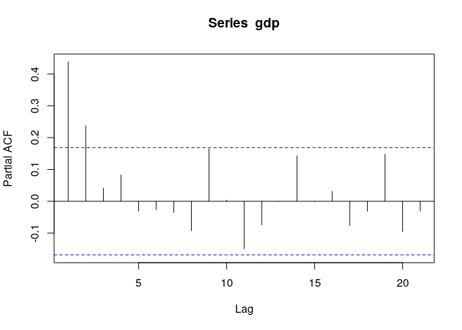
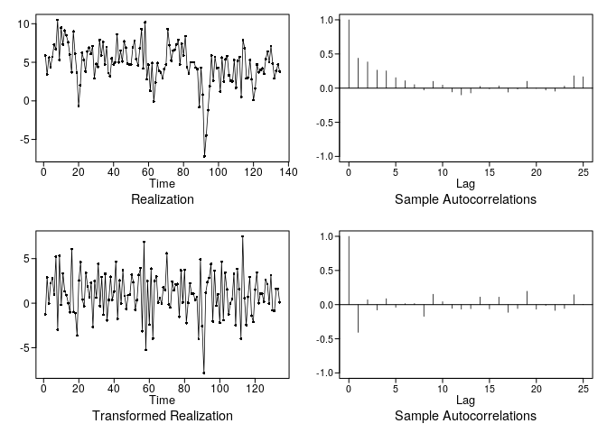
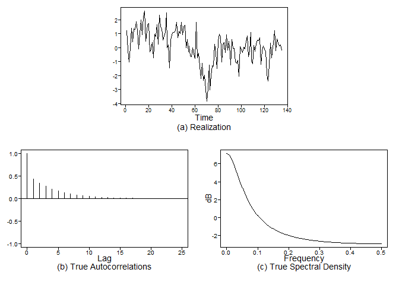
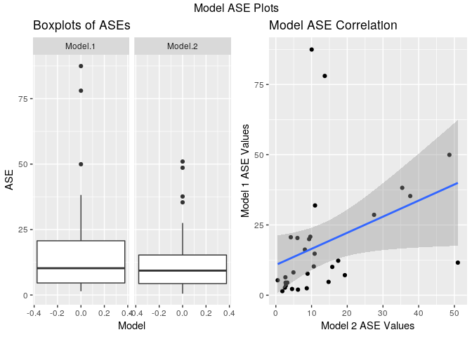
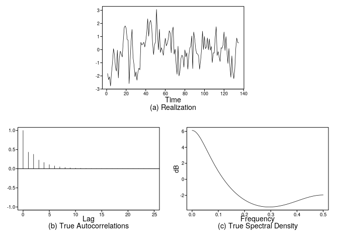
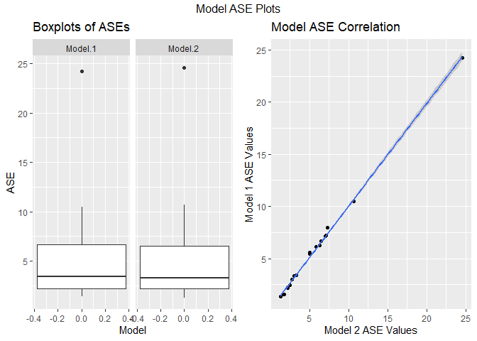
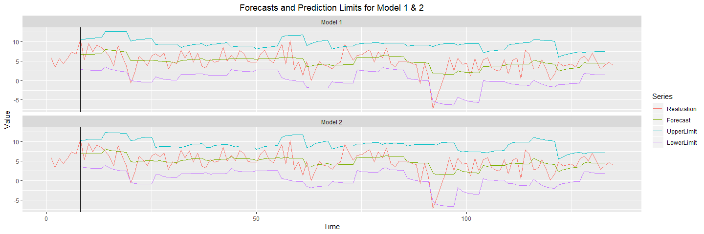

gdp\_modeling
================
Stuart Miller
March 3, 2020

  - [Modeling Requirements](#modeling-requirements)
  - [Univariate Modeling](#univariate-modeling)
      - [Plots](#plots)
      - [Order Selection by AIC/BIC](#order-selection-by-aicbic)
      - [Assessment of Fits](#assessment-of-fits)
          - [ARMA(1,1)](#arma11)
          - [AR(2)](#ar2)
  - [Forecast The Models](#forecast-the-models)
      - [Forecast with a Sliding
        Window](#forecast-with-a-sliding-window)
      - [Compare ASE Values](#compare-ase-values)
      - [Forecast Plots](#forecast-plots)
  - [Model Comparison Summary](#model-comparison-summary)

# Modeling Requirements

  - At least 2 candidate ARMA / ARIMA models
  - The models in factored form with standard deviation.
  - AIC
  - ASE
  - Visualization of Forecasts with a Practical Horizon.

# Univariate Modeling

## Plots

From the realization, a constant mean seems to be a reasonable
assumption. The ACF may suggest an AR-type model. However, it is
possible that there is a hint of oscillation in the ACF.

``` r
vals <- plotts.sample.wge(gdp)
```

<!-- -->

``` r
pacf(gdp)
```

<!-- -->

## Order Selection by AIC/BIC

Using aic5 to fit models based on MLE, 4 of the same model orders are
selected by AIC and BIC

  - ARMA(1, 1)
  - ARMA(2, 0)
  - ARMA(1, 2)
  - ARMA(1, 2)

<!-- end list -->

``` r
# should fits for AIC and BIC
bic_vals <- aic5.wge(gdp, type = 'bic')
```

    ## ---------WORKING... PLEASE WAIT... 
    ## 
    ## 
    ## Five Smallest Values of  bic

``` r
aic_vals <- aic5.wge(gdp, type = 'aic')
```

    ## ---------WORKING... PLEASE WAIT... 
    ## 
    ## 
    ## Five Smallest Values of  aic

``` r
cbind(bic_vals,aic_vals)
```

    ##      p    q        bic    p    q        aic
    ## 5    1    1   1.750246    1    1   1.685685
    ## 7    2    0   1.750466    2    0   1.685904
    ## 4    1    0   1.771632    2    1   1.697374
    ## 8    2    1   1.783456    1    2   1.697743
    ## 6    1    2   1.783825    3    0   1.699064

## Assessment of Fits

Since the AIC and BIC selection methods selected ARMA(1,1), lets look at
the ARMA(1,1). Since the PACF shows two partial autocorrelation, lets
look at the AR(2).

### ARMA(1,1)

The ARMA(1,1) is fit. The AR root is dominate, but it is a relatively
low value. The MA root is should have little impact.

\[
\left( 1 - 0.7887B \right) X_t = \left( 1-0.4513B \right) a_t, \,\,\, \sigma^2_a=5.162
\]

``` r
est1 <- est.arma.wge(gdp, 1, 1)
```

    ## 
    ## Coefficients of Original polynomial:  
    ## 0.7887 
    ## 
    ## Factor                 Roots                Abs Recip    System Freq 
    ## 1-0.7887B              1.2679               0.7887       0.0000
    ##   
    ## 

``` r
factor.wge(est1$theta)
```

    ## 
    ## Coefficients of Original polynomial:  
    ## 0.4513 
    ## 
    ## Factor                 Roots                Abs Recip    System Freq 
    ## 1-0.4513B              2.2160               0.4513       0.0000
    ##   
    ## 

``` r
print(paste('estimated white noise variance: ', est1$avar))
```

    ## [1] "estimated white noise variance:  5.16156650251428"

When the AR(1) from the ARMA(1,1) fit is removed from the realization,
the result appears to be consistent with an MA(1), which is consistent.

``` r
est1 <- est.arma.wge(gdp, 1, 1)
```

    ## 
    ## Coefficients of Original polynomial:  
    ## 0.7887 
    ## 
    ## Factor                 Roots                Abs Recip    System Freq 
    ## 1-0.7887B              1.2679               0.7887       0.0000
    ##   
    ## 

``` r
artrans.wge(gdp, phi.tr = est1$phi)
```

<!-- -->

    ##   [1] -1.253526484  2.918306772 -0.016906493  2.229573470  2.804220177
    ##   [6]  0.942246893  5.215486874 -2.981699674  5.319713498 -0.192966372
    ##  [11]  3.342246893  1.322526949  0.895766930  0.005626902 -1.032399814
    ##  [16]  6.081686781 -0.998599721 -1.111273144 -3.618313219  2.552113312
    ##  [21]  4.622533395  0.409853526 -0.380286502  3.402813451  1.852106865
    ##  [26]  0.657740214  2.288726856 -2.700006447  2.512673423  0.614080149
    ##  [31]  4.429573470 -0.330993088  2.946473516 -1.294373098  3.292953479
    ##  [36] -1.921133116  0.360560112  2.976053433  0.361966837  1.292953479
    ##  [41]  4.656333488 -1.783106400  2.556333488 -0.026766465  3.677460158
    ##  [46]  0.826753572 -0.642259786  0.914080149  0.992953479  3.192953479
    ##  [51]  2.357740214 -0.752119758  0.340840167  3.171826809  3.936613544
    ##  [56] -3.135219712  6.887320130 -5.245079684  2.491546753 -2.407046521
    ##  [61]  3.874646707 -3.964793181  2.478873330  3.007040074  0.035206819
    ##  [66]  0.623940121 -0.018313219  1.812673423  1.466193460  5.592953479
    ##  [71] -0.135219712 -0.478879777  2.398586828  1.473233535  2.094360205
    ##  [76]  2.142246893 -1.530993088  3.692953479  0.063373563  3.746473516
    ##  [81] -2.225359740  0.029573470  2.239433442  1.056333488  1.056333488
    ##  [86]  0.356333488  0.708446800 -4.033806540  4.930986642 -2.591553200
    ##  [91] -7.830986642  1.178879777  2.349299860  2.846479963  4.401406726
    ##  [96] -2.053526484  3.649293414 -0.295779823  0.987320130 -2.191553200
    ## [101]  4.653520037 -1.916906493  3.428166744  1.540840167 -1.274653154
    ## [106] -0.002819898  0.449293414  3.328166744 -2.480286502  3.859153386
    ## [111]  1.598586828 -3.995779823  7.505633349  0.569006912 -2.463386456
    ## [116]  0.712673423  2.933800093 -1.380286502 -2.108453247  1.521126670
    ## [121]  3.438026716 -0.007046521  1.081686781  1.045066791  0.187320130
    ## [126]  2.639433442  2.140840167 -0.047893135  3.156333488 -0.800006447
    ## [131] -0.885919851  1.612673423  1.623940121  0.092953479

Additionally, the true plots for the fitted phi and theta values seem
generally consistent with the sample plots.

``` r
true_vals <- plotts.true.wge(n = 135, phi = est1$phi, theta = est1$theta, vara = est1$avar)
```

<!-- -->

### AR(2)

The AR(2) is fit. Both AR roots are relatively low in value of the abs
reciprocal.

\[
\left( 1 - 0.6777B \right) \left( 1 + 0.3456B \right) X_t =  a_t, \,\,\, \sigma^2_a=5.163
\]

``` r
est2 <- est.arma.wge(gdp, 2, 0)
```

    ## 
    ## Coefficients of Original polynomial:  
    ## 0.3321 0.2342 
    ## 
    ## Factor                 Roots                Abs Recip    System Freq 
    ## 1-0.6777B              1.4757               0.6777       0.0000
    ## 1+0.3456B             -2.8937               0.3456       0.5000
    ##   
    ## 

``` r
print(paste('estimated white noise variance: ', est2$avar))
```

    ## [1] "estimated white noise variance:  5.16270090214452"

When the AR(2) fit is removed from the realization, the result appears
to be consistent with white noise (at least from the ACF)

``` r
est2 <- est.arma.wge(gdp, 2)
```

    ## 
    ## Coefficients of Original polynomial:  
    ## 0.3321 0.2342 
    ## 
    ## Factor                 Roots                Abs Recip    System Freq 
    ## 1-0.6777B              1.4757               0.6777       0.0000
    ## 1+0.3456B             -2.8937               0.3456       0.5000
    ##   
    ## 

``` r
vals <- artrans.wge(gdp, phi.tr = est2$phi)
```

<!-- -->

Additionally, the true plots for the fitted phi and theta values seem
generally consistent with the sample plots.

``` r
true_vals <- plotts.true.wge(n = 135, phi = est2$phi, theta = est2$theta, vara = est2$avar)
```

<!-- -->

# Forecast The Models

## Forecast with a Sliding Window

  - Window size: 12 (3 years)
  - Validation size: 6 (1.5 years)
  - Window step size: 6 (1.5 years)

<!-- end list -->

``` r
# control loop variables
n.head <- 6             # size of the validation forecast
window.size <- 12        # size of the rolling window (train and test)
                         # training size is `window.size - n.head + 1`
window.start.step <- 6  # size of the step to take between each iteration

# create dummy vactors ot hold ASE values
f1.mse.values <- c(1:9)
f2.mse.values <- c(1:9)

# collect the overall forecasts and limits
f1.fcast <- c(rep(NA,135))
f1.fcast.ul <- c(rep(NA,135))
f1.fcast.ll <- c(rep(NA,135))
f2.fcast <- c(rep(NA,135))
f2.fcast.ul <- c(rep(NA,135))
f2.fcast.ll <- c(rep(NA,135))

# roll over the realization
 for (i in seq(0, 20)){
   
   idx.start <- i * window.start.step + 1
   idx.end <- idx.start + window.size
   # forecast with f1
   f1 <- fore.aruma.wge(gdp[ idx.start : idx.end ],
                        phi = est1$phi,
                        theta = est1$theta, 
                        plot = F, 
                        n.ahead = n.head, 
                        lastn = T)
   
   # get the rolling forecast and limits
   for (j in seq(1, n.head)){
     f1.fcast[idx.end - n.head + j] <- f1$f[j]
     f1.fcast.ul[idx.end - n.head + j] <- f1$ul[j]
     f1.fcast.ll[idx.end - n.head + j] <- f1$ll[j]
   }
   
   # calculate ASE from f1 forecast
   f1.mse.values[i+1] <- mean( ( gdp[ (idx.end - n.head + 1) : idx.end ] - f1$f )^2 )
   
   # forecast with f2
   f2 <- fore.aruma.wge(gdp[ idx.start : idx.end ],
                        phi = est2$phi,
                        theta = est2$theta, 
                        plot = F, 
                        n.ahead = n.head, 
                        lastn = T)
   
   # get the rolling forecast and limits
   for (j in seq(1, n.head)){
     f2.fcast[idx.end - n.head + j] <- f2$f[j]
     f2.fcast.ul[idx.end - n.head + j] <- f2$ul[j]
     f2.fcast.ll[idx.end - n.head + j] <- f2$ll[j]
   }
   
   # calculate ASE from f2 forecast
   f2.mse.values[i+1] <- mean( ( gdp[ (idx.end - n.head + 1) : idx.end ] - f2$f )^2 )
 }

# put the ASE values in a dataframe for plotting
model.res <- data.frame(
  ASE = c(f1.mse.values, f2.mse.values),
  Model = factor(c(rep('Model 1',length(f1.mse.values)),rep('Model 2',length(f2.mse.values))))
)

# just formatting the data to make the plot easier
f1.data <- data.frame(
  Realization = gdp[seq_along(f1.fcast)],
  Forecast = f1.fcast,
  UpperLimit = f1.fcast.ul,
  LowerLimit = f1.fcast.ll,
  Time = seq_along(f1.fcast),
  Model = rep('Model 1',length(f1.fcast))
)
f1.data <- gather(f1.data, Series, Value, Realization:LowerLimit, factor_key = T)

f2.data <- data.frame(
  Realization = gdp[seq_along(f2.fcast)],
  Forecast = f2.fcast,
  UpperLimit = f2.fcast.ul,
  LowerLimit = f2.fcast.ll,
  Time = seq_along(f2.fcast),
  Model = rep('Model 2',length(f2.fcast))
)
f2.data <- gather(f2.data, Series, Value, Realization:LowerLimit, factor_key = T)
f1f2 <- rbind(f1.data, f2.data)

print(paste('The mean ASE for model 1:', mean(f1.mse.values)))
```

    ## [1] "The mean ASE for model 1: 5.37465528584588"

``` r
print(paste('The mean ASE for model 2:', mean(f2.mse.values)))
```

    ## [1] "The mean ASE for model 2: 5.2610292788865"

## Compare ASE Values

The ASE values from the two models appear to be very similar. The
outlying error (approximately 22), is the large dip in the series, which
both models miss.

``` r
p1 <- data.frame(
  Model = as.factor(c(rep('Model.1', length(f1.mse.values)),
                      rep('Model.2', length(f2.mse.values)))),
  ASE = c(f1.mse.values, f2.mse.values)
) %>%
  ggplot(aes(y = ASE)) +
  geom_boxplot() +
  facet_wrap(~ Model) +
  ggtitle('Boxplots of ASEs') +
  xlab('Model')

p2 <- data.frame(
  Model.1.ASE = f1.mse.values,
  Model.2.ASE = f2.mse.values
) %>%
  ggplot(aes(y = f1.mse.values, x = f2.mse.values)) +
  geom_point() +
  geom_smooth(method = 'lm') +
  ggtitle('Model ASE Correlation') +
  xlab('Model 2 ASE Values') +
  ylab('Model 1 ASE Values')

grid.arrange(p1, p2, ncol = 2, top = 'Model ASE Plots')
```

<!-- -->

## Forecast Plots

Based on the plots of the sliding window forecasts, the models show
similar forecast performance. Both models miss the dip just after the
start of the window and the large dip just before step 100. Generally,
both models appear to capture the movement of the mean. The intervals
appear to be reasonable. The intervals for model 2 appear to be slightly
more tight around the series. This is particularly noticable at t = 100.

``` r
ggplot(f1f2, aes(y = Value, x = Time, col = Series)) +
  geom_line() +
  facet_wrap(~ Model, dir = 'v') + 
  geom_vline(xintercept = window.size - n.head + 2) +
  #geom_text(aes(x=27, label="\nForecast", y=7000), colour="blue", angle=0, size = 6) +
  #geom_text(aes(x=13, label="\nInitial\nTraining", y=7000), colour="blue", angle=0, size = 6) +
  labs(title = 'Forecasts and Prediction Limits for Model 1 & 2') +
  theme(plot.title = element_text(hjust = 0.5))
```

<!-- -->

# Model Comparison Summary

The table below summarizes the model fit metrics. These show little
difference between the two models.

| Model | Type      | Mean ASE | AIC   | BIC   | WNV Estimate |
| ----- | --------- | -------- | ----- | ----- | ------------ |
| 1     | ARMA(1,1) | 5.375    | 1.686 | 1.750 | 5.161        |
| 2     | AR(2)     | 5.261    | 1.686 | 1.750 | 5.163        |

**Model 1 Equation**

\[
\left( 1 - 0.7887B \right) X_t = \left( 1-0.4513B \right) a_t, \,\,\, \sigma^2_a=5.162
\]

**Model 2 Equation**

\[
\left( 1 - 0.6777B \right) \left( 1 + 0.3456B \right) X_t =  a_t, \,\,\, \sigma^2_a=5.163
\]
