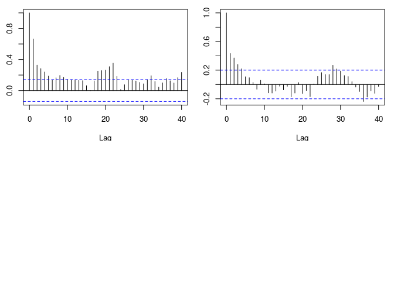
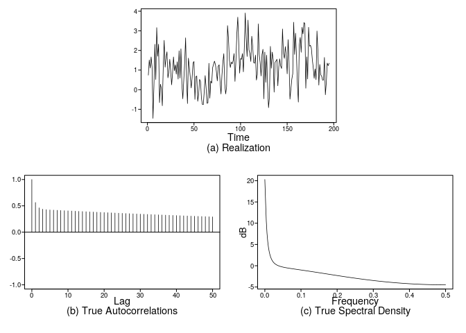

GDP Modeling
================
Stuart Miller
2020-03-05 19:08:40

# Univariate Modeling

## Plots

**Assess Constant Mean**

Based on the realization, it looks like there may be a slight downward
trend. This appears to be more pronounced prior to time step 75. After
time step 75, the movement of the realization appears to be more flat.
We will assume that the assumption of constant mean is not met.

**Assess Constant Variance**

The variance of the realization appears to be larger eariler in the
realization (around and before 75). Later in time, the variance of the
realization appears to decrease. Based on these observations and because
only one realization is possible, we will assume that the assumption of
constant variance is not met.

**Assess Constant ACF**

The ACF of teh first half and the ACF of the second half appear to be
different. Both show expotentially dampped autocorrelations from 0, but
these autocorrelations fall off slower in the first half. Additionally,
the ACFs show different oscillator behavior.

**Conclusion**

Given the assessment of stationary above, we propose that this
realization does not meet the requirements of a stationary process.

``` r
vals <- plotts.sample.wge(gdp, lag.max = 50)
```

<!-- -->

``` r
size = length(gdp)
acf(gdp[1:size/2], lag.max = 40)
acf(gdp[(size/2+1):(size-1)], lag.max = 40)
```

<!-- -->

## ARMA Fit

### ARMA Order Selection by AIC/BIC

The following models are suggested by both AIC and BIC

  - ARMA(2, 1)
  - ARMA(1, 2)
  - ARMA(3, 1)

<!-- end list -->

``` r
# should fits for AIC and BIC
bic_vals <- aic5.wge(gdp, type = 'bic')
```

    ## ---------WORKING... PLEASE WAIT... 
    ## 
    ## 
    ## Five Smallest Values of  bic

``` r
aic_vals <- aic5.wge(gdp, type = 'aic')
```

    ## ---------WORKING... PLEASE WAIT... 
    ## 
    ## 
    ## Five Smallest Values of  aic

``` r
cbind(bic_vals,aic_vals)
```

    ##       p    q        bic    p    q        aic
    ## 8     2    1   2.467879    2    1   2.400740
    ## 6     1    2   2.474865    3    1   2.405507
    ## 5     1    1   2.477624    1    2   2.407727
    ## 11    3    1   2.489430    2    2   2.408653
    ## 9     2    2   2.492576    4    1   2.414109

### Fit ARMA Model

A fit of the ARMA(2,1), which selected by AIC and BIC, as a root very
close to one. This is also a suggestion of a non-stationary series.

``` r
est.arma <- est.arma.wge(gdp, 2, 1)
```

    ## 
    ## Coefficients of Original polynomial:  
    ## 1.2175 -0.2239 
    ## 
    ## Factor                 Roots                Abs Recip    System Freq 
    ## 1-0.9917B              1.0084               0.9917       0.0000
    ## 1-0.2257B              4.4298               0.2257       0.0000
    ##   
    ## 

``` r
factor.wge(phi = est.arma$phi)
```

    ## 
    ## Coefficients of Original polynomial:  
    ## 1.2175 -0.2239 
    ## 
    ## Factor                 Roots                Abs Recip    System Freq 
    ## 1-0.9917B              1.0084               0.9917       0.0000
    ## 1-0.2257B              4.4298               0.2257       0.0000
    ##   
    ## 

``` r
factor.wge(phi = est.arma$theta)
```

    ## 
    ## Coefficients of Original polynomial:  
    ## 0.9128 
    ## 
    ## Factor                 Roots                Abs Recip    System Freq 
    ## 1-0.9128B              1.0955               0.9128       0.0000
    ##   
    ## 

### Comparison of True Plots

The true plots of the model fit are shown below. It is notable that the
evidence of oscillation seen in the sample autocorrelation is not
present in the true plots of the model
fit.

``` r
vals <- plotts.true.wge(n = length(gdp), phi = est.arma$phi, theta = est.arma$theta, lag.max = 50)
```

<!-- -->

## ARIMA Fit

After taking the first difference, the only first autocorrelation
appears to be significant. This suggests that an MA(1) may be sufficient
to explain the noise after the first difference.

``` r
diff <- artrans.wge(data$gdp_change, phi.tr = 1, plottr = TRUE)
```

<!-- -->

``` r
bic_vals <- aic5.wge(diff, type = 'bic')
```

    ## ---------WORKING... PLEASE WAIT... 
    ## 
    ## 
    ## Five Smallest Values of  bic

``` r
aic_vals <- aic5.wge(diff, type = 'aic')
```

    ## ---------WORKING... PLEASE WAIT... 
    ## 
    ## 
    ## Five Smallest Values of  aic

``` r
cbind(bic_vals,aic_vals)
```

    ##       p    q        bic    p    q        aic
    ## 2     0    1   2.448261    1    1   2.410123
    ## 5     1    1   2.460657    0    1   2.414572
    ## 3     0    2   2.523776    0    2   2.473242
    ## 10    3    0   2.567351    5    0   2.490651
    ## 13    4    0   2.580732    4    0   2.496508

``` r
est.arima <- est.arma.wge(diff, 0, 1)
```

# Forecast The Models

## Forecast with a Sliding Window

  - Window size: 12 (3 years)
  - Validation size: 6 (1.5 years)
  - Window step size: 6 (1.5 years)

<!-- end list -->

``` r
# control loop variables
n.head <- 6             # size of the validation forecast
window.size <- 12        # size of the rolling window (train and test)
                         # training size is `window.size - n.head + 1`
window.start.step <- 6  # size of the step to take between each iteration

# create dummy vactors ot hold ASE values
f1.mse.values <- c(1:19)
f2.mse.values <- c(1:19)

# collect the overall forecasts and limits
f1.fcast <- c(rep(NA,135))
f1.fcast.ul <- c(rep(NA,135))
f1.fcast.ll <- c(rep(NA,135))
f2.fcast <- c(rep(NA,135))
f2.fcast.ul <- c(rep(NA,135))
f2.fcast.ll <- c(rep(NA,135))

# roll over the realization
 for (i in seq(0, 30)){
   
   idx.start <- i * window.start.step + 1
   idx.end <- idx.start + window.size
   # forecast with f1
   f1 <- fore.aruma.wge(gdp[ idx.start : idx.end ],
                        phi = est.arma$phi,
                        theta = est.arma$theta, 
                        plot = F, 
                        n.ahead = n.head, 
                        lastn = T)
   
   # get the rolling forecast and limits
   for (j in seq(1, n.head)){
     f1.fcast[idx.end - n.head + j] <- f1$f[j]
     f1.fcast.ul[idx.end - n.head + j] <- f1$ul[j]
     f1.fcast.ll[idx.end - n.head + j] <- f1$ll[j]
   }
   
   # calculate ASE from f1 forecast
   f1.mse.values[i+1] <- mean( ( gdp[ (idx.end - n.head + 1) : idx.end ] - f1$f )^2 )
   
   # forecast with f2
   f2 <- fore.aruma.wge(gdp[ idx.start : idx.end ],
                        d = 1,
                        phi = 0,
                        theta = est.arima$theta, 
                        plot = F, 
                        n.ahead = n.head, 
                        lastn = T)
   
   # get the rolling forecast and limits
   for (j in seq(1, n.head)){
     f2.fcast[idx.end - n.head + j] <- f2$f[j]
     f2.fcast.ul[idx.end - n.head + j] <- f2$ul[j]
     f2.fcast.ll[idx.end - n.head + j] <- f2$ll[j]
   }
   
   # calculate ASE from f2 forecast
   f2.mse.values[i+1] <- mean( ( gdp[ (idx.end - n.head + 1) : idx.end ] - f2$f )^2 )
 }

# put the ASE values in a dataframe for plotting
model.res <- data.frame(
  ASE = c(f1.mse.values, f2.mse.values),
  Model = factor(c(rep('Model 1',length(f1.mse.values)),rep('Model 2',length(f2.mse.values))))
)

# just formatting the data to make the plot easier
f1.data <- data.frame(
  Realization = gdp[seq_along(f1.fcast)],
  Forecast = f1.fcast,
  UpperLimit = f1.fcast.ul,
  LowerLimit = f1.fcast.ll,
  Time = seq_along(f1.fcast),
  Model = rep('Model 1',length(f1.fcast))
)
f1.data <- gather(f1.data, Series, Value, Realization:LowerLimit, factor_key = T)

f2.data <- data.frame(
  Realization = gdp[seq_along(f2.fcast)],
  Forecast = f2.fcast,
  UpperLimit = f2.fcast.ul,
  LowerLimit = f2.fcast.ll,
  Time = seq_along(f2.fcast),
  Model = rep('Model 2',length(f2.fcast))
)
f2.data <- gather(f2.data, Series, Value, Realization:LowerLimit, factor_key = T)
f1f2 <- rbind(f1.data, f2.data)

print(paste('The mean ASE for model 1:', mean(f1.mse.values)))
```

    ## [1] "The mean ASE for model 1: 18.34768548381"

``` r
print(paste('The mean ASE for model 2:', mean(f2.mse.values)))
```

    ## [1] "The mean ASE for model 2: 13.2422988525228"

## Compare ASE Values

``` r
p1 <- data.frame(
  Model = as.factor(c(rep('Model.1', length(f1.mse.values)),
                      rep('Model.2', length(f2.mse.values)))),
  ASE = c(f1.mse.values, f2.mse.values)
) %>%
  ggplot(aes(y = ASE)) +
  geom_boxplot() +
  facet_wrap(~ Model) +
  ggtitle('Boxplots of ASEs') +
  xlab('Model')

p2 <- data.frame(
  Model.1.ASE = f1.mse.values,
  Model.2.ASE = f2.mse.values
) %>%
  ggplot(aes(y = f1.mse.values, x = f2.mse.values)) +
  geom_point() +
  geom_smooth(method = 'lm') +
  ggtitle('Model ASE Correlation') +
  xlab('Model 2 ASE Values') +
  ylab('Model 1 ASE Values')

grid.arrange(p1, p2, ncol = 2, top = 'Model ASE Plots')
```

<!-- -->

## Forecast Plots

In the plots below, model 1 is the ARMA(2,1) model and model 2 is the
ARIMA(0,1,1) model. The forecasts begin at the vertical line `t =` 8.

``` r
ggplot(f1f2, aes(y = Value, x = Time, col = Series)) +
  geom_line() +
  facet_wrap(~ Model, dir = 'v') + 
  geom_vline(xintercept = window.size - n.head + 2) +
  #geom_text(aes(x=27, label="\nForecast", y=7000), colour="blue", angle=0, size = 6) +
  #geom_text(aes(x=13, label="\nInitial\nTraining", y=7000), colour="blue", angle=0, size = 6) +
  labs(title = 'Forecasts and Prediction Limits for Model 1 & 2') +
  theme(plot.title = element_text(hjust = 0.5))
```

<!-- -->

### Forecast Conclusion

The ARIMA(0,1,1) model generally appears to capture the movement of the
realization better than the ARMA(2,1) model. The ARMA model appear to
have forecast jumps that are not consistent with the realization; the
ARIMA model does not exhibit this behavior. The prediction bounds of the
ARIMA model also appear to show more confidence on the movement of the
realization.

**Rolling Window Validation Results**

| Model        | ASE   |
| ------------ | ----- |
| ARMA(2,1)    | 18.35 |
| ARIMA(0,1,1) | 13.24 |

The ARIMA model appears to be a better model of the realization than the
ARMA model.
